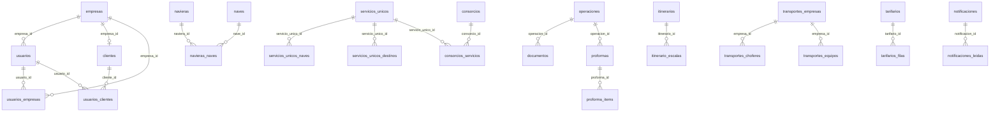

# Base de Datos Completa — EMBARQUES / ASLI

> [!info] Origen
> Documento generado el **7 de agosto de 2026** desde el proyecto Supabase en vivo.
> Pensado para importar en **Obsidian** (frontmatter YAML, callouts, wikilinks, Mermaid).

## Índice

- [[#Resumen ejecutivo]]
- [[#Alerta de seguridad]]
- [[#Tipos ENUM]]
- [[#Extensiones Postgres]]
- [[#Diagrama ER]]
- [[#Claves foráneas]]
- [[#Funciones]]
- [[#Triggers]]
- [[#Catálogos de valores]]
- [[#Inventario de tablas]]
- [[#Detalle por tabla]]
- [[#Políticas RLS]]
- [[#Notas de modelo]]

---

## Resumen ejecutivo

| Métrica | Valor |
|---------|-------|
| Tablas en `public` | **43** |
| Con RLS activo | **41** |
| Sin RLS | **2** (`ejecutivos`, `agencias_aduana`) |
| Operaciones totales | **978** |
| Itinerarios / escalas | **427** / **1 004** |
| Usuarios | **18** |
| Empresas | **28** |
| Funciones `public` | **18** |
| Triggers | **21** |
| FKs declaradas | **~27** |

> [!note] Soft delete
> En `operaciones` y `proformas` se usa `deleted_at` (no se borran filas físicamente).

---

## Alerta de seguridad

> [!danger] RLS deshabilitado
> Las tablas `ejecutivos` y `agencias_aduana` están **expuestas** a `anon`/`authenticated`.
>
> ```sql
> ALTER TABLE public.ejecutivos ENABLE ROW LEVEL SECURITY;
> ALTER TABLE public.agencias_aduana ENABLE ROW LEVEL SECURITY;
> ```
> Definir políticas **antes** o junto con el ENABLE.

> [!warning] Políticas abiertas
> Varias tablas de consorcios/servicios y `sesiones_activas`/`empresas`/`usuarios` tienen políticas `public` muy permisivas. Revisar.

---

## Tipos ENUM

### `rol_usuario_enum`

| Orden | Valor |
|------:|-------|
| 1 | `admin` |
| 2 | `ejecutivo` |
| 3 | `cliente` |
| 4 | `superadmin` |
| 5 | `operador` |
| 6 | `usuario` |

Usado en: [[#usuarios|usuarios.rol]]

### `tipo_empresa_enum`

| Orden | Valor |
|------:|-------|
| 1 | `cliente` |
| 2 | `naviera` |
| 3 | `agencia_aduana` |
| 4 | `deposito` |
| 5 | `transportista` |
| 6 | `consignatario` |
| 7 | `otro` |

---

## Extensiones Postgres

| Extensión | Versión |
|-----------|---------|
| `plpgsql` | 1.0 |
| `pgcrypto` | 1.3 |
| `uuid-ossp` | 1.1 |
| `pg_stat_statements` | 1.11 |
| `supabase_vault` | 0.3.1 |

---

## Diagrama ER



---

## Claves foráneas

| Tabla | Columna | Referencia |
|-------|---------|------------|
| [[#consorcios_destinos_activos\|consorcios_destinos_activos]] | `consorcio_id` | `consorcios.id` |
| [[#consorcios_destinos_activos\|consorcios_destinos_activos]] | `destino_id` | `servicios_unicos_destinos.id` |
| [[#consorcios_destinos_activos\|consorcios_destinos_activos]] | `servicio_unico_id` | `servicios_unicos.id` |
| [[#consorcios_servicios\|consorcios_servicios]] | `consorcio_id` | `consorcios.id` |
| [[#consorcios_servicios\|consorcios_servicios]] | `servicio_unico_id` | `servicios_unicos.id` |
| [[#documentos\|documentos]] | `operacion_id` | `operaciones.id` |
| [[#documentos\|documentos]] | `created_by` | `auth.users.id` |
| [[#itinerario_escalas\|itinerario_escalas]] | `itinerario_id` | `itinerarios.id` |
| [[#navieras_naves\|navieras_naves]] | `nave_id` | `naves.id` |
| [[#navieras_naves\|navieras_naves]] | `naviera_id` | `navieras.id` |
| [[#notificaciones\|notificaciones]] | `creado_por_auth_id` | `auth.users.id` |
| [[#notificaciones_leidas\|notificaciones_leidas]] | `notificacion_id` | `notificaciones.id` |
| [[#notificaciones_leidas\|notificaciones_leidas]] | `usuario_auth_id` | `auth.users.id` |
| [[#proforma_items\|proforma_items]] | `proforma_id` | `proformas.id` |
| [[#proformas\|proformas]] | `operacion_id` | `operaciones.id` |
| [[#servicios_unicos_destinos\|servicios_unicos_destinos]] | `servicio_unico_id` | `servicios_unicos.id` |
| [[#servicios_unicos_naves\|servicios_unicos_naves]] | `servicio_unico_id` | `servicios_unicos.id` |
| [[#tarifarios\|tarifarios]] | `created_by` | `auth.users.id` |
| [[#tarifarios_filas\|tarifarios_filas]] | `tarifario_id` | `tarifarios.id` |
| [[#transportes_choferes\|transportes_choferes]] | `empresa_id` | `transportes_empresas.id` |
| [[#transportes_equipos\|transportes_equipos]] | `empresa_id` | `transportes_empresas.id` |
| [[#usuarios\|usuarios]] | `empresa_id` | `empresas.id` |
| [[#usuarios\|usuarios]] | `auth_id` | `auth.users.id` |
| [[#usuarios_clientes\|usuarios_clientes]] | `cliente_id` | `clientes.id` |
| [[#usuarios_clientes\|usuarios_clientes]] | `usuario_id` | `usuarios.id` |
| [[#usuarios_empresas\|usuarios_empresas]] | `empresa_id` | `empresas.id` |
| [[#usuarios_empresas\|usuarios_empresas]] | `usuario_id` | `usuarios.id` |

> [!tip] Denormalización
> `operaciones` guarda muchos campos como **texto** (`cliente`, `naviera`, `nave`, `pod`…) sin FK. Las relaciones lógicas no están enforced.

---

## Funciones

| Función | Retorno | Seguridad | Uso |
|---------|---------|-----------|-----|
| `buscar_tracking(termino text)` | TABLE(...) | SECURITY DEFINER | Búsqueda pública de operaciones para tracking |
| `generate_ref_asli()` | trigger | INVOKER | Genera ref_asli ASLI-YYYY-NNN al insertar operación |
| `get_cliente_nombres_for_user()` | text[] | SECURITY DEFINER | Nombres de empresas del usuario |
| `get_user_rol()` | text | SECURITY DEFINER | Rol del usuario autenticado |
| `handle_new_user()` | trigger | SECURITY DEFINER | Crea fila en usuarios al registrarse en Auth |
| `incrementar_visitas()` | bigint | SECURITY DEFINER | Incrementa conteo_visitas |
| `is_admin_or_staff()` | boolean | SECURITY DEFINER | admin/superadmin/operador activo |
| `is_ejecutivo()` | boolean | SECURITY DEFINER | ejecutivo activo |
| `is_staff_no_config()` | boolean | SECURITY DEFINER | Staff sin acceso a configuración |
| `is_superadmin()` | boolean | SECURITY DEFINER | superadmin activo |
| `marcar_consorcios_requiere_revision()` | trigger | INVOKER | Marca consorcios al cambiar servicios |
| `set_consignatarios_updated_at()` | trigger | INVOKER | updated_at consignatarios |
| `set_formatos_updated_at()` | trigger | INVOKER | updated_at formatos |
| `set_updated_at()` | trigger | INVOKER | updated_at genérico |
| `sync_operaciones_tracking_manual(...)` | integer | SECURITY DEFINER | Sincroniza lat/lng tracking por nave/viaje |
| `update_consorcios_updated_at()` | trigger | INVOKER | updated_at consorcios* |
| `update_servicios_unicos_updated_at()` | trigger | INVOKER | updated_at servicios* |
| `ver_toda_la_base()` | TABLE(tabla, datos) | INVOKER | Utilidad de inspección JSON |

---

## Triggers

| Tabla | Timing | Acción |
|-------|--------|--------|
| [[#consignatarios\|consignatarios]] | BEFORE UPDATE | consignatarios_updated_at → set_consignatarios_updated_at() |
| [[#consorcios\|consorcios]] | BEFORE UPDATE | consorcios_updated_at → set_updated_at() |
| [[#consorcios\|consorcios]] | BEFORE UPDATE | update_consorcios_updated_at_trigger → update_consorcios_updated_at() |
| [[#consorcios_destinos_activos\|consorcios_destinos_activos]] | BEFORE UPDATE | update_consorcios_destinos_activos_updated_at_trigger |
| [[#consorcios_servicios\|consorcios_servicios]] | BEFORE UPDATE | update_consorcios_servicios_updated_at_trigger |
| [[#formatos_documentos\|formatos_documentos]] | BEFORE UPDATE | trg_formatos_documentos_updated_at |
| [[#itinerario_escalas\|itinerario_escalas]] | BEFORE UPDATE | itinerario_escalas_updated_at → set_updated_at() |
| [[#itinerarios\|itinerarios]] | BEFORE UPDATE | itinerarios_updated_at → set_updated_at() |
| [[#operaciones\|operaciones]] | BEFORE INSERT | trg_generate_ref_asli → generate_ref_asli() |
| [[#servicios_unicos\|servicios_unicos]] | AFTER UPDATE | servicios_unicos_marcar_consorcios_revision_trigger |
| [[#servicios_unicos\|servicios_unicos]] | BEFORE UPDATE | servicios_unicos_updated_at / update_servicios_unicos_updated_at_trigger |
| [[#servicios_unicos_destinos\|servicios_unicos_destinos]] | BEFORE UPDATE | update_servicios_unicos_destinos_updated_at_trigger |
| [[#servicios_unicos_naves\|servicios_unicos_naves]] | BEFORE UPDATE | update_servicios_unicos_naves_updated_at_trigger |
| [[#tarifarios\|tarifarios]] | BEFORE UPDATE | tarifarios_updated_at |
| [[#transportes_choferes\|transportes_choferes]] | BEFORE UPDATE | transportes_choferes_updated_at |
| [[#transportes_costos_extra\|transportes_costos_extra]] | BEFORE UPDATE | transportes_costos_extra_updated_at |
| [[#transportes_empresas\|transportes_empresas]] | BEFORE UPDATE | transportes_empresas_updated_at |
| [[#transportes_equipos\|transportes_equipos]] | BEFORE UPDATE | transportes_equipos_updated_at |
| [[#transportes_reservas_ext\|transportes_reservas_ext]] | BEFORE UPDATE | transportes_reservas_ext_updated_at |
| [[#transportes_tramos\|transportes_tramos]] | BEFORE UPDATE | transportes_tramos_updated_at |

---

## Catálogos de valores

Tabla fuente: [[#catalogos]]

| Categoría | Valores activos |
|-----------|-----------------|
| `estado_operacion` | SOLICITUD, PENDIENTE, CONFIRMADO, ARRIBADO, CANCELADO, ROLEADO |
| `forma_pago` | PREPAID, COLLECT, PREPAID/COLLECT |
| `incoterm` | FOB, CIF, CFR, EXW, FCA, CPT, CIP, DAP, DPU, DDP |
| `moneda` | USD, CLP, EUR |
| `prioridad` | ALTA, MEDIA, BAJA |
| `tipo_atmosfera` | ATMÓSFERA REGULAR, CA DAIKIN, CA STARCOOL, CA CARRIER, CA THERMO KING, ATMÓSFERA MODIFICADA |
| `tipo_operacion` | EXPORTACIÓN MARITIMO, IMPORTACIÓN MARITIMO, EXPORTACION AEREO, IMPORTACION AEREO |
| `tipo_unidad` | 40RF, 40HC, 40DV, 20RF, 20DV, 45HC |
| `tratamiento_frio` | SIN TRATAMIENTO, COLD TREATMENT (USDA), COLD TREATMENT (APHIS), PRE-COOLING |

---

## Inventario de tablas

| Tabla | Filas | RLS | Cols | Descripción |
|-------|------:|:---:|-----:|-------------|
| [[#agencias_aduana\|agencias_aduana]] | 0 | ❌ | 11 | Agencias de aduana |
| [[#catalogos\|catalogos]] | 45 | ✅ | 7 | Listas de valores del sistema |
| [[#clientes\|clientes]] | 11 | ✅ | 8 | Datos comerciales por empresa |
| [[#consignatarios\|consignatarios]] | 2 | ✅ | 23 | Consignee / Notify party |
| [[#consorcios\|consorcios]] | 20 | ✅ | 9 | Consorcios navieros |
| [[#consorcios_destinos_activos\|consorcios_destinos_activos]] | 0 | ✅ | 8 | Destinos activos por consorcio |
| [[#consorcios_servicios\|consorcios_servicios]] | 47 | ✅ | 7 | Servicios dentro de un consorcio |
| [[#conteo_visitas\|conteo_visitas]] | 1 | ✅ | 3 | Contador global de visitas |
| [[#contratos\|contratos]] | 5 | ✅ | 4 | Contratos navieros |
| [[#depositos\|depositos]] | 13 | ✅ | 6 | Depósitos portuarios |
| [[#destinos\|destinos]] | 178 | ✅ | 6 | Puertos de destino (POD) |
| [[#documentos\|documentos]] | 0 | ✅ | 9 | Archivos asociados a operaciones |
| [[#ejecutivos\|ejecutivos]] | 0 | ❌ | 8 | Contactos ejecutivos por empresa |
| [[#empresas\|empresas]] | 28 | ✅ | 4 | Empresas / clientes (nombre) |
| [[#especies\|especies]] | 15 | ✅ | 5 | Especies de carga |
| [[#formatos_documentos\|formatos_documentos]] | 0 | ✅ | 13 | Plantillas HTML/Excel |
| [[#itinerario_escalas\|itinerario_escalas]] | 1.004 | ✅ | 10 | Escalas (POD/ETA) por itinerario |
| [[#itinerarios\|itinerarios]] | 427 | ✅ | 16 | Itinerarios navieros |
| [[#naves\|naves]] | 225 | ✅ | 5 | Catálogo de naves |
| [[#navieras\|navieras]] | 14 | ✅ | 5 | Catálogo de navieras |
| [[#navieras_naves\|navieras_naves]] | 457 | ✅ | 5 | Relación N:N naviera ↔ nave |
| [[#notificaciones\|notificaciones]] | 31 | ✅ | 8 | Notificaciones in-app |
| [[#notificaciones_leidas\|notificaciones_leidas]] | 32 | ✅ | 3 | Lectura por usuario |
| [[#operaciones\|operaciones]] | 978 | ✅ | 104 | Tabla central de embarques |
| [[#plantas\|plantas]] | 29 | ✅ | 11 | Plantas de presentación |
| [[#proforma_items\|proforma_items]] | 0 | ✅ | 17 | Ítems de proforma comercial |
| [[#proformas\|proformas]] | 0 | ✅ | 35 | Proformas comerciales |
| [[#puertos_origen\|puertos_origen]] | 4 | ✅ | 5 | Puertos de origen (POL) |
| [[#servicios_unicos\|servicios_unicos]] | 48 | ✅ | 11 | Servicios navieros |
| [[#servicios_unicos_destinos\|servicios_unicos_destinos]] | 208 | ✅ | 9 | Destinos por servicio |
| [[#servicios_unicos_naves\|servicios_unicos_naves]] | 196 | ✅ | 7 | Naves por servicio |
| [[#sesiones_activas\|sesiones_activas]] | 660 | ✅ | 6 | Presencia / visitantes |
| [[#tarifarios\|tarifarios]] | 6 | ✅ | 12 | Cabecera tarifarios |
| [[#tarifarios_filas\|tarifarios_filas]] | 26 | ✅ | 23 | Filas de tarifario |
| [[#transportes_choferes\|transportes_choferes]] | 61 | ✅ | 9 | Choferes por empresa |
| [[#transportes_costos_extra\|transportes_costos_extra]] | 7 | ✅ | 9 | Conceptos extra proforma |
| [[#transportes_empresas\|transportes_empresas]] | 9 | ✅ | 5 | Empresas de transporte |
| [[#transportes_equipos\|transportes_equipos]] | 58 | ✅ | 7 | Patentes camión/remolque |
| [[#transportes_reservas_ext\|transportes_reservas_ext]] | 0 | ✅ | 36 | Reservas externas transporte |
| [[#transportes_tramos\|transportes_tramos]] | 26 | ✅ | 8 | Tarifario origen→destino |
| [[#usuarios\|usuarios]] | 18 | ✅ | 8 | Perfiles (rol, auth_id) |
| [[#usuarios_clientes\|usuarios_clientes]] | 0 | ✅ | 4 | N:N usuario ↔ cliente |
| [[#usuarios_empresas\|usuarios_empresas]] | 8 | ✅ | 4 | N:N usuario ↔ empresa |

---

## Detalle por tabla

### Módulo: Usuarios y acceso

#### usuarios

> [!abstract] Perfiles (rol, auth_id)
> Filas ≈ **18** · RLS: **ON** · Columnas: **8**

| # | Columna | Tipo | Null | Default |
|--:|---------|------|:----:|---------|
| 1 | `id` | uuid | NO | `gen_random_uuid()` |
| 2 | `empresa_id` | uuid | YES | — |
| 3 | `nombre` | text | NO | — |
| 4 | `email` | text | NO | — |
| 5 | `rol` | rol_usuario_enum | NO | — |
| 6 | `activo` | boolean | YES | `true` |
| 7 | `created_at` | timestamp with time zone | YES | `now()` |
| 8 | `auth_id` | uuid | YES | — |

- **PK:** `id`
- **UNIQUE:** `email`
- **FK:**
  - `empresa_id` → `empresas.id`
  - `auth_id` → `auth.users.id`
- **Índices extra:** `idx_usuarios_activo`, `idx_usuarios_auth_id`, `idx_usuarios_email`, `idx_usuarios_empresa`, `idx_usuarios_rol`
- **RLS:**
  - SELECT público ⚠️
  - service_role INSERT
  - UPDATE propio (auth.uid()=id)

---

#### empresas

> [!abstract] Empresas / clientes (nombre)
> Filas ≈ **28** · RLS: **ON** · Columnas: **4**

| # | Columna | Tipo | Null | Default |
|--:|---------|------|:----:|---------|
| 1 | `id` | uuid | NO | `gen_random_uuid()` |
| 2 | `nombre` | text | NO | — |
| 3 | `created_at` | timestamp with time zone | YES | `now()` |
| 4 | `cliente_abr` | text | YES | — |

- **PK:** `id`
- **UNIQUE:** `nombre`
- **RLS:**
  - SELECT público
  - INSERT público ⚠️

---

#### clientes

> [!abstract] Datos comerciales por empresa
> Filas ≈ **11** · RLS: **ON** · Columnas: **8**

| # | Columna | Tipo | Null | Default |
|--:|---------|------|:----:|---------|
| 1 | `id` | uuid | NO | `gen_random_uuid()` |
| 2 | `empresa_id` | uuid | NO | — |
| 3 | `limite_credito` | numeric | YES | — |
| 4 | `condicion_pago` | text | YES | — |
| 5 | `descuento` | numeric | YES | — |
| 6 | `activo` | boolean | YES | `true` |
| 7 | `created_at` | timestamp with time zone | YES | `now()` |
| 8 | `updated_at` | timestamp with time zone | YES | `now()` |

- **PK:** `id`
- **UNIQUE:** `empresa_id`
- **Índices extra:** `idx_clientes_empresa`
- **RLS:**
  - Cliente SELECT asignados
  - Ejecutivo ALL asignados
  - Superadmin ALL
  - Staff ALL

---

#### usuarios_empresas

> [!abstract] N:N usuario ↔ empresa
> Filas ≈ **8** · RLS: **ON** · Columnas: **4**

| # | Columna | Tipo | Null | Default |
|--:|---------|------|:----:|---------|
| 1 | `id` | uuid | NO | `gen_random_uuid()` |
| 2 | `usuario_id` | uuid | NO | — |
| 3 | `empresa_id` | uuid | NO | — |
| 4 | `created_at` | timestamp with time zone | YES | `now()` |

- **PK:** `id`
- **UNIQUE:** `usuario_id + empresa_id`
- **FK:**
  - `empresa_id` → `empresas.id`
  - `usuario_id` → `usuarios.id`
- **Índices extra:** `idx_usuarios_empresas_empresa`, `idx_usuarios_empresas_usuario`
- **RLS:**
  - Usuario lee propias
  - Superadmin ALL

---

#### usuarios_clientes

> [!abstract] N:N usuario ↔ cliente
> Filas ≈ **0** · RLS: **ON** · Columnas: **4**

| # | Columna | Tipo | Null | Default |
|--:|---------|------|:----:|---------|
| 1 | `id` | uuid | NO | `gen_random_uuid()` |
| 2 | `usuario_id` | uuid | NO | — |
| 3 | `cliente_id` | uuid | NO | — |
| 4 | `created_at` | timestamp with time zone | YES | `now()` |

- **PK:** `id`
- **UNIQUE:** `usuario_id + cliente_id`
- **FK:**
  - `cliente_id` → `clientes.id`
  - `usuario_id` → `usuarios.id`
- **Índices extra:** `idx_usuarios_clientes_cliente`, `idx_usuarios_clientes_usuario`
- **RLS:**
  - Usuario lee propias
  - Superadmin ALL

---

#### ejecutivos

> [!abstract] Contactos ejecutivos por empresa
> Filas ≈ **0** · RLS: **OFF** · Columnas: **8**

| # | Columna | Tipo | Null | Default |
|--:|---------|------|:----:|---------|
| 1 | `id` | uuid | NO | `gen_random_uuid()` |
| 2 | `empresa_id` | uuid | NO | — |
| 3 | `nombre` | text | NO | — |
| 4 | `cargo` | text | NO | — |
| 5 | `telefono` | text | YES | — |
| 6 | `email` | text | NO | — |
| 7 | `activo` | boolean | YES | `true` |
| 8 | `created_at` | timestamp with time zone | YES | `now()` |

- **PK:** `id`
- **UNIQUE:** `empresa_id + email`
- **CHECK:** `email formato regex válido`
- **Índices extra:** `idx_ejecutivos_empresa`
- **RLS:**
  - ❌ SIN RLS

---

#### sesiones_activas

> [!abstract] Presencia / visitantes
> Filas ≈ **660** · RLS: **ON** · Columnas: **6**

| # | Columna | Tipo | Null | Default |
|--:|---------|------|:----:|---------|
| 1 | `session_id` | text | NO | — |
| 2 | `last_seen` | timestamp with time zone | NO | `now()` |
| 3 | `nombre` | text | NO | `'Visitante'::text` |
| 4 | `email` | text | NO | `''::text` |
| 5 | `rol` | text | NO | `'visitante'::text` |
| 6 | `es_autenticado` | boolean | NO | `false` |

- **PK:** `session_id`
- **RLS:**
  - INSERT/SELECT/UPDATE público ⚠️

---

#### conteo_visitas

> [!abstract] Contador global de visitas
> Filas ≈ **1** · RLS: **ON** · Columnas: **3**

| # | Columna | Tipo | Null | Default |
|--:|---------|------|:----:|---------|
| 1 | `id` | integer | NO | `1` |
| 2 | `total` | bigint | NO | `0` |
| 3 | `updated_at` | timestamp with time zone | YES | `now()` |

- **PK:** `id`
- **CHECK:** `id = 1`
- **RLS:**
  - SELECT público
  - UPDATE bloqueado

---

#### notificaciones

> [!abstract] Notificaciones in-app
> Filas ≈ **31** · RLS: **ON** · Columnas: **8**

| # | Columna | Tipo | Null | Default |
|--:|---------|------|:----:|---------|
| 1 | `id` | uuid | NO | `gen_random_uuid()` |
| 2 | `tipo` | text | NO | — |
| 3 | `titulo` | text | NO | — |
| 4 | `mensaje` | text | NO | — |
| 5 | `creado_por_auth_id` | uuid | YES | — |
| 6 | `creado_por_nombre` | text | NO | `''::text` |
| 7 | `datos` | jsonb | YES | — |
| 8 | `created_at` | timestamp with time zone | NO | `now()` |

- **PK:** `id`
- **FK:**
  - `creado_por_auth_id` → `auth.users.id`
- **Índices extra:** `idx_notificaciones_created_at (DESC)`
- **RLS:**
  - INSERT/SELECT autenticado

---

#### notificaciones_leidas

> [!abstract] Lectura por usuario
> Filas ≈ **32** · RLS: **ON** · Columnas: **3**

| # | Columna | Tipo | Null | Default |
|--:|---------|------|:----:|---------|
| 1 | `notificacion_id` | uuid | NO | — |
| 2 | `usuario_auth_id` | uuid | NO | — |
| 3 | `leido_at` | timestamp with time zone | NO | `now()` |

- **PK:** `notificacion_id`, `usuario_auth_id`
- **FK:**
  - `notificacion_id` → `notificaciones.id`
  - `usuario_auth_id` → `auth.users.id`
- **Índices extra:** `idx_notificaciones_leidas_usuario`
- **RLS:**
  - CRUD solo propio usuario_auth_id

---

### Módulo: Operaciones

#### operaciones

> [!abstract] Tabla central de embarques
> Filas ≈ **978** · RLS: **ON** · Columnas: **104**

| # | Columna | Tipo | Null | Default |
|--:|---------|------|:----:|---------|
| 1 | `id` | uuid | NO | `gen_random_uuid()` |
| 2 | `correlativo` | bigint | NO | `nextval('operaciones_correlativo_seq'::regclass)` |
| 3 | `ingreso` | timestamp with time zone | NO | `now()` |
| 4 | `semana` | integer | YES | — |
| 5 | `ejecutivo` | text | NO | — |
| 6 | `estado_operacion` | text | NO | — |
| 7 | `tipo_operacion` | text | NO | — |
| 8 | `cliente` | text | NO | — |
| 9 | `consignatario` | text | YES | — |
| 10 | `incoterm` | text | YES | — |
| 11 | `forma_pago` | text | YES | — |
| 12 | `especie` | text | YES | — |
| 13 | `pais` | text | YES | — |
| 14 | `temperatura` | text | YES | — |
| 15 | `ventilacion` | integer | YES | — |
| 16 | `pallets` | integer | YES | — |
| 17 | `peso_bruto` | numeric(12,2) | YES | — |
| 18 | `peso_neto` | numeric(12,2) | YES | — |
| 19 | `tipo_unidad` | text | YES | — |
| 20 | `naviera` | text | YES | — |
| 21 | `nave` | text | YES | — |
| 22 | `pol` | text | YES | — |
| 23 | `etd` | date | YES | — |
| 24 | `pod` | text | YES | — |
| 25 | `eta` | date | YES | — |
| 26 | `tt` | integer | YES | — |
| 27 | `booking` | text | YES | — |
| 28 | `aga` | text | YES | — |
| 29 | `dus` | text | YES | — |
| 30 | `sps` | text | YES | — |
| 31 | `numero_guia_despacho` | text | YES | — |
| 32 | `planta_presentacion` | text | YES | — |
| 33 | `citacion` | timestamp with time zone | YES | — |
| 34 | `llegada_planta` | timestamp with time zone | YES | — |
| 35 | `salida_planta` | timestamp with time zone | YES | — |
| 36 | `inicio_stacking` | timestamp with time zone | YES | — |
| 37 | `fin_stacking` | timestamp with time zone | YES | — |
| 38 | `ingreso_stacking` | timestamp with time zone | YES | — |
| 39 | `corte_documental` | timestamp with time zone | YES | — |
| 40 | `inf_late` | timestamp with time zone | YES | — |
| 41 | `late_inicio` | timestamp with time zone | YES | — |
| 42 | `late_fin` | timestamp with time zone | YES | — |
| 43 | `xlate_inicio` | timestamp with time zone | YES | — |
| 44 | `xlate_fin` | timestamp with time zone | YES | — |
| 45 | `deposito` | text | YES | — |
| 46 | `agendamiento_retiro` | timestamp with time zone | YES | — |
| 47 | `devolucion_unidad` | timestamp with time zone | YES | — |
| 48 | `transporte` | text | YES | — |
| 49 | `chofer` | text | YES | — |
| 50 | `rut_chofer` | text | YES | — |
| 51 | `telefono_chofer` | text | YES | — |
| 52 | `patente_camion` | text | YES | — |
| 53 | `patente_remolque` | text | YES | — |
| 54 | `contenedor` | text | YES | — |
| 55 | `sello` | text | YES | — |
| 56 | `tara` | numeric(10,2) | YES | — |
| 57 | `almacenamiento` | integer | YES | — |
| 58 | `tramo` | text | YES | — |
| 59 | `valor_tramo` | numeric(12,2) | YES | — |
| 60 | `porteo` | boolean | YES | `false` |
| 61 | `valor_porteo` | numeric(12,2) | YES | — |
| 62 | `falso_flete` | boolean | YES | `false` |
| 63 | `valor_falso_flete` | numeric(12,2) | YES | — |
| 64 | `factura_transporte` | text | YES | — |
| 65 | `monto_facturado` | numeric(12,2) | YES | — |
| 66 | `numero_factura_asli` | text | YES | — |
| 67 | `concepto_facturado` | text | YES | — |
| 68 | `moneda` | text | YES | `'CLP'::text` |
| 69 | `tipo_cambio` | numeric(10,4) | YES | — |
| 70 | `margen_estimado` | numeric(12,2) | YES | — |
| 71 | `margen_real` | numeric(12,2) | YES | — |
| 72 | `fecha_confirmacion_booking` | timestamp with time zone | YES | — |
| 73 | `fecha_envio_documentacion` | timestamp with time zone | YES | — |
| 74 | `fecha_entrega_bl` | timestamp with time zone | YES | — |
| 75 | `fecha_entrega_factura` | timestamp with time zone | YES | — |
| 76 | `fecha_pago_cliente` | timestamp with time zone | YES | — |
| 77 | `fecha_pago_transporte` | timestamp with time zone | YES | — |
| 78 | `fecha_cierre` | timestamp with time zone | YES | — |
| 79 | `prioridad` | text | YES | — |
| 80 | `operacion_critica` | boolean | YES | `false` |
| 81 | `origen_registro` | text | YES | `'manual'::text` |
| 82 | `observaciones` | text | YES | — |
| 83 | `created_by` | uuid | YES | — |
| 84 | `updated_by` | uuid | YES | — |
| 85 | `created_at` | timestamp with time zone | YES | `now()` |
| 86 | `updated_at` | timestamp with time zone | YES | `now()` |
| 87 | `deleted_at` | timestamp with time zone | YES | — |
| 88 | `ref_asli` | text | YES | — |
| 89 | `enviado_transporte` | boolean | NO | `false` |
| 90 | `tratamiento_frio` | text | YES | — |
| 91 | `tipo_atmosfera` | text | YES | — |
| 92 | `tratamiento_frio_o2` | integer | YES | — |
| 93 | `tratamiento_frio_co2` | integer | YES | — |
| 94 | `viaje` | text | YES | — |
| 95 | `booking_doc_url` | text | YES | — |
| 96 | `tipo_reserva_transporte` | text | YES | — |
| 97 | `transporte_deleted_at` | timestamp with time zone | YES | — |
| 98 | `dueno_reserva` | text | YES | `'ASLI'::text` |
| 99 | `tracking_manual_lat` | double precision | YES | — |
| 100 | `tracking_manual_lng` | double precision | YES | — |
| 101 | `tracking_manual_updated_at` | timestamp with time zone | YES | — |
| 102 | `contrato` | text | YES | — |
| 103 | `temporada` | text | YES | — |
| 104 | `segundas` | text | YES | — |

- **PK:** `id`
- **UNIQUE:** `correlativo`; `ref_asli`
- **CHECK:** `prioridad IN (baja, media, alta)`
- **Índices extra:** `idx_operaciones_enviado_transporte (parcial: enviado_transporte=true AND deleted_at IS NULL)`, `idx_operaciones_ref_asli`, `idx_operaciones_segundas`, `idx_operaciones_temporada`
- **RLS:**
  - Cliente INSERT reserva_web
  - Cliente SELECT propias
  - Ejecutivo ALL propias
  - Staff ALL

---

#### documentos

> [!abstract] Archivos asociados a operaciones
> Filas ≈ **0** · RLS: **ON** · Columnas: **9**

| # | Columna | Tipo | Null | Default |
|--:|---------|------|:----:|---------|
| 1 | `id` | uuid | NO | `gen_random_uuid()` |
| 2 | `operacion_id` | uuid | NO | — |
| 3 | `tipo` | text | NO | — |
| 4 | `nombre_archivo` | text | NO | — |
| 5 | `url` | text | NO | — |
| 6 | `tamano` | integer | YES | — |
| 7 | `mime_type` | text | YES | — |
| 8 | `created_at` | timestamp with time zone | YES | `now()` |
| 9 | `created_by` | uuid | YES | — |

- **PK:** `id`
- **CHECK:** `tipo IN (BOOKING, INSTRUCTIVO_EMBARQUE, FACTURA_GATE_OUT, FACTURA_PROFORMA, CERTIFICADO_FITOSANITARIO, CERTIFICADO_ORIGEN, BL_TELEX_SWB_AWB, FACTURA_COMERCIAL, DUS, FULLSET, SOLICITUD_RESERVA)`
- **FK:**
  - `operacion_id` → `operaciones.id`
  - `created_by` → `auth.users.id`
- **Índices extra:** `idx_documentos_operacion`, `idx_documentos_tipo`
- **RLS:**
  - Cliente SELECT sus ops
  - Ejecutivo ALL sus ops
  - Staff ALL
  - SELECT público ⚠️

---

#### proformas

> [!abstract] Proformas comerciales
> Filas ≈ **0** · RLS: **ON** · Columnas: **35**

| # | Columna | Tipo | Null | Default |
|--:|---------|------|:----:|---------|
| 1 | `id` | uuid | NO | `gen_random_uuid()` |
| 2 | `numero` | text | YES | — |
| 3 | `operacion_id` | uuid | YES | — |
| 4 | `ref_asli` | text | YES | — |
| 5 | `fecha` | date | YES | `CURRENT_DATE` |
| 6 | `exportador` | text | YES | — |
| 7 | `exportador_rut` | text | YES | — |
| 8 | `exportador_direccion` | text | YES | — |
| 9 | `importador` | text | YES | — |
| 10 | `importador_direccion` | text | YES | — |
| 11 | `importador_pais` | text | YES | — |
| 12 | `clausula_venta` | text | YES | — |
| 13 | `moneda` | text | YES | `'USD'::text` |
| 14 | `puerto_origen` | text | YES | — |
| 15 | `puerto_destino` | text | YES | — |
| 16 | `etd` | date | YES | — |
| 17 | `naviera` | text | YES | — |
| 18 | `nave` | text | YES | — |
| 19 | `booking` | text | YES | — |
| 20 | `dus` | text | YES | — |
| 21 | `csg` | text | YES | — |
| 22 | `csp` | text | YES | — |
| 23 | `total_cajas` | integer | YES | — |
| 24 | `total_kg_neto` | numeric(14,3) | YES | — |
| 25 | `total_valor` | numeric(14,2) | YES | — |
| 26 | `observaciones` | text | YES | — |
| 27 | `created_by` | uuid | YES | — |
| 28 | `created_at` | timestamp with time zone | YES | `now()` |
| 29 | `updated_at` | timestamp with time zone | YES | `now()` |
| 30 | `deleted_at` | timestamp with time zone | YES | — |
| 31 | `contenedor` | text | YES | — |
| 32 | `destino` | text | YES | — |
| 33 | `consignee_uscc` | text | YES | — |
| 34 | `total_kg_bruto` | numeric(14,3) | YES | — |
| 35 | `viaje` | text | YES | — |

- **PK:** `id`
- **UNIQUE:** `numero`
- **FK:**
  - `operacion_id` → `operaciones.id`
- **RLS:**
  - Staff roles ALL

---

#### proforma_items

> [!abstract] Ítems de proforma comercial
> Filas ≈ **0** · RLS: **ON** · Columnas: **17**

| # | Columna | Tipo | Null | Default |
|--:|---------|------|:----:|---------|
| 1 | `id` | uuid | NO | `gen_random_uuid()` |
| 2 | `proforma_id` | uuid | NO | — |
| 3 | `orden` | integer | YES | `0` |
| 4 | `especie` | text | YES | — |
| 5 | `variedad` | text | YES | — |
| 6 | `calibre` | text | YES | — |
| 7 | `kg_neto_caja` | numeric(10,3) | YES | — |
| 8 | `cantidad_cajas` | integer | YES | — |
| 9 | `kg_neto_total` | numeric(14,3) | YES | — |
| 10 | `valor_caja` | numeric(12,4) | YES | — |
| 11 | `valor_kilo` | numeric(12,4) | YES | — |
| 12 | `valor_total` | numeric(14,2) | YES | — |
| 13 | `kg_bruto_caja` | numeric(10,3) | YES | — |
| 14 | `kg_bruto_total` | numeric(14,3) | YES | — |
| 15 | `tipo_envase` | text | YES | — |
| 16 | `categoria` | text | YES | — |
| 17 | `etiqueta` | text | YES | — |

- **PK:** `id`
- **FK:**
  - `proforma_id` → `proformas.id`
- **RLS:**
  - Staff roles ALL

---

#### formatos_documentos

> [!abstract] Plantillas HTML/Excel
> Filas ≈ **0** · RLS: **ON** · Columnas: **13**

| # | Columna | Tipo | Null | Default |
|--:|---------|------|:----:|---------|
| 1 | `id` | uuid | NO | `gen_random_uuid()` |
| 2 | `nombre` | text | NO | — |
| 3 | `tipo` | text | NO | `'otro'::text` |
| 4 | `descripcion` | text | YES | — |
| 5 | `contenido_html` | text | NO | `''::text` |
| 6 | `activo` | boolean | NO | `true` |
| 7 | `created_by` | uuid | YES | — |
| 8 | `created_at` | timestamp with time zone | NO | `now()` |
| 9 | `updated_at` | timestamp with time zone | NO | `now()` |
| 10 | `template_type` | text | NO | `'html'::text` |
| 11 | `excel_path` | text | YES | — |
| 12 | `excel_nombre` | text | YES | — |
| 13 | `cliente` | text | YES | — |

- **PK:** `id`
- **CHECK:** `template_type IN (html, excel)`; `tipo IN (factura, proforma, instructivo, conocimiento_embarque, packing_list, certificado_origen, otro)`
- **Índices extra:** `idx_formatos_documentos_cliente`
- **RLS:**
  - Ejecutivo/operador SELECT activos
  - Admin ALL

---

### Módulo: Itinerarios y navieras

#### navieras

> [!abstract] Catálogo de navieras
> Filas ≈ **14** · RLS: **ON** · Columnas: **5**

| # | Columna | Tipo | Null | Default |
|--:|---------|------|:----:|---------|
| 1 | `id` | uuid | NO | `gen_random_uuid()` |
| 2 | `nombre` | text | NO | — |
| 3 | `codigo` | text | YES | — |
| 4 | `activo` | boolean | YES | `true` |
| 5 | `created_at` | timestamp with time zone | YES | `now()` |

- **PK:** `id`
- **UNIQUE:** `nombre`
- **RLS:**
  - SELECT público (duplicada)
  - service_role SELECT

---

#### naves

> [!abstract] Catálogo de naves
> Filas ≈ **225** · RLS: **ON** · Columnas: **5**

| # | Columna | Tipo | Null | Default |
|--:|---------|------|:----:|---------|
| 1 | `id` | uuid | NO | `gen_random_uuid()` |
| 2 | `nombre` | text | NO | — |
| 3 | `imo` | text | YES | — |
| 4 | `activo` | boolean | YES | `true` |
| 5 | `created_at` | timestamp with time zone | YES | `now()` |

- **PK:** `id`
- **UNIQUE:** `nombre`
- **RLS:**
  - SELECT público (duplicada)
  - service_role ALL

---

#### navieras_naves

> [!abstract] Relación N:N naviera ↔ nave
> Filas ≈ **457** · RLS: **ON** · Columnas: **5**

| # | Columna | Tipo | Null | Default |
|--:|---------|------|:----:|---------|
| 1 | `id` | uuid | NO | `gen_random_uuid()` |
| 2 | `naviera_id` | uuid | NO | — |
| 3 | `nave_id` | uuid | NO | — |
| 4 | `activo` | boolean | YES | `true` |
| 5 | `created_at` | timestamp with time zone | YES | `now()` |

- **PK:** `id`
- **UNIQUE:** `naviera_id + nave_id`
- **FK:**
  - `nave_id` → `naves.id`
  - `naviera_id` → `navieras.id`
- **Índices extra:** `idx_navieras_naves_nave`, `idx_navieras_naves_naviera`
- **RLS:**
  - SELECT público (duplicada)
  - service_role ALL

---

#### servicios_unicos

> [!abstract] Servicios navieros
> Filas ≈ **48** · RLS: **ON** · Columnas: **11**

| # | Columna | Tipo | Null | Default |
|--:|---------|------|:----:|---------|
| 1 | `id` | uuid | NO | `gen_random_uuid()` |
| 2 | `nombre` | text | NO | — |
| 3 | `naviera_id` | uuid | NO | — |
| 4 | `descripcion` | text | YES | — |
| 5 | `activo` | boolean | YES | `true` |
| 6 | `created_at` | timestamp with time zone | YES | `now()` |
| 7 | `updated_at` | timestamp with time zone | YES | `now()` |
| 8 | `created_by` | text | YES | — |
| 9 | `updated_by` | text | YES | — |
| 10 | `puerto_origen` | text | YES | — |
| 11 | `naviera_nombre` | text | YES | `''::text` |

- **PK:** `id`
- **Índices extra:** `idx_servicios_unicos_activo`, `idx_servicios_unicos_naviera`, `idx_servicios_unicos_naviera_id`, `idx_servicios_unicos_nombre`
- **RLS:**
  - service_role ALL
  - authenticated SELECT
  - public ALL abierto ⚠️

---

#### servicios_unicos_naves

> [!abstract] Naves por servicio
> Filas ≈ **196** · RLS: **ON** · Columnas: **7**

| # | Columna | Tipo | Null | Default |
|--:|---------|------|:----:|---------|
| 1 | `id` | uuid | NO | `gen_random_uuid()` |
| 2 | `servicio_unico_id` | uuid | NO | — |
| 3 | `nave_nombre` | text | NO | — |
| 4 | `activo` | boolean | YES | `true` |
| 5 | `orden` | integer | YES | `0` |
| 6 | `created_at` | timestamp with time zone | YES | `now()` |
| 7 | `updated_at` | timestamp with time zone | YES | `now()` |

- **PK:** `id`
- **UNIQUE:** `servicio_unico_id + nave_nombre`
- **FK:**
  - `servicio_unico_id` → `servicios_unicos.id`
- **Índices extra:** `idx_servicios_unicos_naves_servicio`, `idx_servicios_unicos_naves_servicio_id`
- **RLS:**
  - service_role ALL
  - authenticated SELECT
  - public ALL abierto ⚠️

---

#### servicios_unicos_destinos

> [!abstract] Destinos por servicio
> Filas ≈ **208** · RLS: **ON** · Columnas: **9**

| # | Columna | Tipo | Null | Default |
|--:|---------|------|:----:|---------|
| 1 | `id` | uuid | NO | `gen_random_uuid()` |
| 2 | `servicio_unico_id` | uuid | NO | — |
| 3 | `puerto` | text | NO | — |
| 4 | `puerto_nombre` | text | YES | — |
| 5 | `area` | text | YES | `'ASIA'::text` |
| 6 | `orden` | integer | NO | — |
| 7 | `activo` | boolean | YES | `true` |
| 8 | `created_at` | timestamp with time zone | YES | `now()` |
| 9 | `updated_at` | timestamp with time zone | YES | `now()` |

- **PK:** `id`
- **UNIQUE:** `servicio_unico_id + puerto`
- **FK:**
  - `servicio_unico_id` → `servicios_unicos.id`
- **Índices extra:** `idx_servicios_unicos_destinos_orden`, `idx_servicios_unicos_destinos_servicio`, `idx_servicios_unicos_destinos_servicio_id`
- **RLS:**
  - service_role ALL
  - authenticated SELECT
  - public ALL abierto ⚠️

---

#### consorcios

> [!abstract] Consorcios navieros
> Filas ≈ **20** · RLS: **ON** · Columnas: **9**

| # | Columna | Tipo | Null | Default |
|--:|---------|------|:----:|---------|
| 1 | `id` | uuid | NO | `gen_random_uuid()` |
| 2 | `nombre` | text | NO | — |
| 3 | `descripcion` | text | YES | — |
| 4 | `activo` | boolean | YES | `true` |
| 5 | `requiere_revision` | boolean | YES | `false` |
| 6 | `created_at` | timestamp with time zone | YES | `now()` |
| 7 | `updated_at` | timestamp with time zone | YES | `now()` |
| 8 | `created_by` | text | YES | — |
| 9 | `updated_by` | text | YES | — |

- **PK:** `id`
- **Índices extra:** `idx_consorcios_activo`, `idx_consorcios_nombre`
- **RLS:**
  - service_role ALL
  - authenticated SELECT
  - public INSERT/UPDATE/DELETE/SELECT (abiertas ⚠️)

---

#### consorcios_servicios

> [!abstract] Servicios dentro de un consorcio
> Filas ≈ **47** · RLS: **ON** · Columnas: **7**

| # | Columna | Tipo | Null | Default |
|--:|---------|------|:----:|---------|
| 1 | `id` | uuid | NO | `gen_random_uuid()` |
| 2 | `consorcio_id` | uuid | NO | — |
| 3 | `servicio_unico_id` | uuid | NO | — |
| 4 | `orden` | integer | YES | `0` |
| 5 | `activo` | boolean | YES | `true` |
| 6 | `created_at` | timestamp with time zone | YES | `now()` |
| 7 | `updated_at` | timestamp with time zone | YES | `now()` |

- **PK:** `id`
- **UNIQUE:** `consorcio_id + servicio_unico_id`
- **FK:**
  - `consorcio_id` → `consorcios.id`
  - `servicio_unico_id` → `servicios_unicos.id`
- **Índices extra:** `idx_consorcios_servicios_consorcio`, `idx_consorcios_servicios_consorcio_id`, `idx_consorcios_servicios_servicio`, `idx_consorcios_servicios_servicio_unico_id`
- **RLS:**
  - service_role ALL
  - authenticated SELECT
  - public ALL abierto ⚠️

---

#### consorcios_destinos_activos

> [!abstract] Destinos activos por consorcio
> Filas ≈ **0** · RLS: **ON** · Columnas: **8**

| # | Columna | Tipo | Null | Default |
|--:|---------|------|:----:|---------|
| 1 | `id` | uuid | NO | `gen_random_uuid()` |
| 2 | `consorcio_id` | uuid | NO | — |
| 3 | `servicio_unico_id` | uuid | NO | — |
| 4 | `destino_id` | uuid | NO | — |
| 5 | `activo` | boolean | YES | `true` |
| 6 | `orden` | integer | NO | — |
| 7 | `created_at` | timestamp with time zone | YES | `now()` |
| 8 | `updated_at` | timestamp with time zone | YES | `now()` |

- **PK:** `id`
- **UNIQUE:** `consorcio_id + servicio_unico_id + destino_id`
- **FK:**
  - `consorcio_id` → `consorcios.id`
  - `destino_id` → `servicios_unicos_destinos.id`
  - `servicio_unico_id` → `servicios_unicos.id`
- **Índices extra:** `idx_consorcios_destinos_activos_consorcio_id`, `idx_consorcios_destinos_activos_orden`, `idx_consorcios_destinos_activos_servicio_unico_id`
- **RLS:**
  - public ALL abierto ⚠️

---

#### itinerarios

> [!abstract] Itinerarios navieros
> Filas ≈ **427** · RLS: **ON** · Columnas: **16**

| # | Columna | Tipo | Null | Default |
|--:|---------|------|:----:|---------|
| 1 | `id` | uuid | NO | `gen_random_uuid()` |
| 2 | `servicio` | text | NO | `''::text` |
| 3 | `consorcio` | text | YES | — |
| 4 | `naviera` | text | YES | — |
| 5 | `nave` | text | NO | `''::text` |
| 6 | `viaje` | text | NO | `''::text` |
| 7 | `semana` | integer | YES | — |
| 8 | `pol` | text | NO | `''::text` |
| 9 | `etd` | date | YES | — |
| 10 | `servicio_id` | uuid | YES | — |
| 11 | `created_at` | timestamp with time zone | NO | `now()` |
| 12 | `updated_at` | timestamp with time zone | NO | `now()` |
| 13 | `created_by` | uuid | YES | — |
| 14 | `updated_by` | uuid | YES | — |
| 15 | `operador` | text | YES | — |
| 16 | `stacking_imagen_url` | text | YES | — |

- **PK:** `id`
- **Índices extra:** `idx_itinerarios_etd`, `idx_itinerarios_pol`, `idx_itinerarios_servicio`
- **RLS:**
  - SELECT público

---

#### itinerario_escalas

> [!abstract] Escalas (POD/ETA) por itinerario
> Filas ≈ **1.004** · RLS: **ON** · Columnas: **10**

| # | Columna | Tipo | Null | Default |
|--:|---------|------|:----:|---------|
| 1 | `id` | uuid | NO | `gen_random_uuid()` |
| 2 | `itinerario_id` | uuid | NO | — |
| 3 | `puerto` | text | NO | `''::text` |
| 4 | `puerto_nombre` | text | YES | — |
| 5 | `eta` | date | YES | — |
| 6 | `dias_transito` | integer | YES | — |
| 7 | `orden` | integer | NO | `0` |
| 8 | `area` | text | YES | — |
| 9 | `created_at` | timestamp with time zone | NO | `now()` |
| 10 | `updated_at` | timestamp with time zone | NO | `now()` |

- **PK:** `id`
- **FK:**
  - `itinerario_id` → `itinerarios.id`
- **Índices extra:** `idx_escalas_area`, `idx_itinerario_escalas_itinerario`, `idx_itinerario_escalas_orden`
- **RLS:**
  - SELECT público

---

#### contratos

> [!abstract] Contratos navieros
> Filas ≈ **5** · RLS: **ON** · Columnas: **4**

| # | Columna | Tipo | Null | Default |
|--:|---------|------|:----:|---------|
| 1 | `id` | uuid | NO | `gen_random_uuid()` |
| 2 | `nombre` | text | NO | — |
| 3 | `activo` | boolean | NO | `true` |
| 4 | `created_at` | timestamp with time zone | NO | `now()` |

- **PK:** `id`
- **UNIQUE:** `nombre`
- **RLS:**
  - SELECT autenticado
  - Admin INSERT/UPDATE/DELETE

---

### Módulo: Transportes

#### transportes_empresas

> [!abstract] Empresas de transporte
> Filas ≈ **9** · RLS: **ON** · Columnas: **5**

| # | Columna | Tipo | Null | Default |
|--:|---------|------|:----:|---------|
| 1 | `id` | uuid | NO | `gen_random_uuid()` |
| 2 | `nombre` | text | NO | — |
| 3 | `rut` | text | YES | — |
| 4 | `created_at` | timestamp with time zone | NO | `now()` |
| 5 | `updated_at` | timestamp with time zone | NO | `now()` |

- **PK:** `id`
- **UNIQUE:** `nombre`
- **Índices extra:** `idx_transportes_empresas_nombre`
- **RLS:**
  - Auth SELECT
  - Staff ALL

---

#### transportes_choferes

> [!abstract] Choferes por empresa
> Filas ≈ **61** · RLS: **ON** · Columnas: **9**

| # | Columna | Tipo | Null | Default |
|--:|---------|------|:----:|---------|
| 1 | `id` | uuid | NO | `gen_random_uuid()` |
| 2 | `empresa_id` | uuid | NO | — |
| 3 | `nombre` | text | NO | — |
| 4 | `numero_chofer` | text | YES | — |
| 5 | `rut` | text | YES | — |
| 6 | `telefono` | text | YES | — |
| 7 | `activo` | boolean | NO | `true` |
| 8 | `created_at` | timestamp with time zone | NO | `now()` |
| 9 | `updated_at` | timestamp with time zone | NO | `now()` |

- **PK:** `id`
- **FK:**
  - `empresa_id` → `transportes_empresas.id`
- **Índices extra:** `idx_transportes_choferes_activo`, `idx_transportes_choferes_empresa`
- **RLS:**
  - Auth SELECT
  - Staff ALL

---

#### transportes_equipos

> [!abstract] Patentes camión/remolque
> Filas ≈ **58** · RLS: **ON** · Columnas: **7**

| # | Columna | Tipo | Null | Default |
|--:|---------|------|:----:|---------|
| 1 | `id` | uuid | NO | `gen_random_uuid()` |
| 2 | `empresa_id` | uuid | NO | — |
| 3 | `patente_camion` | text | NO | — |
| 4 | `patente_remolque` | text | YES | — |
| 5 | `activo` | boolean | NO | `true` |
| 6 | `created_at` | timestamp with time zone | NO | `now()` |
| 7 | `updated_at` | timestamp with time zone | NO | `now()` |

- **PK:** `id`
- **UNIQUE:** `patente_camion`
- **FK:**
  - `empresa_id` → `transportes_empresas.id`
- **Índices extra:** `idx_transportes_equipos_activo`, `idx_transportes_equipos_empresa`
- **RLS:**
  - Auth SELECT
  - Staff ALL

---

#### transportes_tramos

> [!abstract] Tarifario origen→destino
> Filas ≈ **26** · RLS: **ON** · Columnas: **8**

| # | Columna | Tipo | Null | Default |
|--:|---------|------|:----:|---------|
| 1 | `id` | uuid | NO | `gen_random_uuid()` |
| 2 | `origen` | text | NO | — |
| 3 | `destino` | text | NO | — |
| 4 | `valor` | numeric | NO | `0` |
| 5 | `moneda` | text | NO | `'CLP'::text` |
| 6 | `activo` | boolean | NO | `true` |
| 7 | `created_at` | timestamp with time zone | NO | `now()` |
| 8 | `updated_at` | timestamp with time zone | NO | `now()` |

- **PK:** `id`
- **UNIQUE:** `origen + destino + moneda`
- **Índices extra:** `idx_transportes_tramos_activo`, `idx_transportes_tramos_origen_destino`
- **RLS:**
  - Auth SELECT
  - Staff ALL

---

#### transportes_costos_extra

> [!abstract] Conceptos extra proforma
> Filas ≈ **7** · RLS: **ON** · Columnas: **9**

| # | Columna | Tipo | Null | Default |
|--:|---------|------|:----:|---------|
| 1 | `id` | uuid | NO | `gen_random_uuid()` |
| 2 | `concepto` | text | NO | — |
| 3 | `tarifa_valor` | numeric | YES | — |
| 4 | `tarifa_texto` | text | YES | — |
| 5 | `moneda` | text | NO | `'CLP'::text` |
| 6 | `condicion` | text | YES | — |
| 7 | `activo` | boolean | NO | `true` |
| 8 | `created_at` | timestamp with time zone | NO | `now()` |
| 9 | `updated_at` | timestamp with time zone | NO | `now()` |

- **PK:** `id`
- **UNIQUE:** `concepto`
- **RLS:**
  - Auth SELECT
  - Staff ALL

---

#### transportes_reservas_ext

> [!abstract] Reservas externas transporte
> Filas ≈ **0** · RLS: **ON** · Columnas: **36**

| # | Columna | Tipo | Null | Default |
|--:|---------|------|:----:|---------|
| 1 | `id` | uuid | NO | `gen_random_uuid()` |
| 2 | `cliente` | text | YES | — |
| 3 | `booking` | text | YES | — |
| 4 | `naviera` | text | YES | — |
| 5 | `nave` | text | YES | — |
| 6 | `pod` | text | YES | — |
| 7 | `etd` | date | YES | — |
| 8 | `planta_presentacion` | text | YES | — |
| 9 | `transporte` | text | YES | — |
| 10 | `chofer` | text | YES | — |
| 11 | `rut_chofer` | text | YES | — |
| 12 | `telefono_chofer` | text | YES | — |
| 13 | `patente_camion` | text | YES | — |
| 14 | `patente_remolque` | text | YES | — |
| 15 | `contenedor` | text | YES | — |
| 16 | `sello` | text | YES | — |
| 17 | `tara` | numeric | YES | — |
| 18 | `deposito` | text | YES | — |
| 19 | `citacion` | timestamp with time zone | YES | — |
| 20 | `llegada_planta` | timestamp with time zone | YES | — |
| 21 | `salida_planta` | timestamp with time zone | YES | — |
| 22 | `agendamiento_retiro` | timestamp with time zone | YES | — |
| 23 | `inicio_stacking` | timestamp with time zone | YES | — |
| 24 | `fin_stacking` | timestamp with time zone | YES | — |
| 25 | `ingreso_stacking` | timestamp with time zone | YES | — |
| 26 | `tramo` | text | YES | — |
| 27 | `valor_tramo` | numeric | YES | — |
| 28 | `porteo` | text | YES | — |
| 29 | `valor_porteo` | numeric | YES | — |
| 30 | `falso_flete` | text | YES | — |
| 31 | `valor_falso_flete` | numeric | YES | — |
| 32 | `factura_transporte` | text | YES | — |
| 33 | `observaciones` | text | YES | — |
| 34 | `estado` | text | NO | `'pendiente'::text` |
| 35 | `created_at` | timestamp with time zone | NO | `now()` |
| 36 | `updated_at` | timestamp with time zone | NO | `now()` |

- **PK:** `id`
- **RLS:**
  - Staff ALL
  - Staff/ejecutivo SELECT

---

### Módulo: Catálogos maestros

#### catalogos

> [!abstract] Listas de valores del sistema
> Filas ≈ **45** · RLS: **ON** · Columnas: **7**

| # | Columna | Tipo | Null | Default |
|--:|---------|------|:----:|---------|
| 1 | `id` | uuid | NO | `gen_random_uuid()` |
| 2 | `categoria` | text | NO | — |
| 3 | `valor` | text | NO | — |
| 4 | `descripcion` | text | YES | — |
| 5 | `orden` | integer | YES | `0` |
| 6 | `activo` | boolean | YES | `true` |
| 7 | `created_at` | timestamp with time zone | YES | `now()` |

- **PK:** `id`
- **UNIQUE:** `categoria + valor`
- **Índices extra:** `idx_catalogos_activo`, `idx_catalogos_categoria`
- **RLS:**
  - SELECT público (duplicada)

---

#### consignatarios

> [!abstract] Consignee / Notify party
> Filas ≈ **2** · RLS: **ON** · Columnas: **23**

| # | Columna | Tipo | Null | Default |
|--:|---------|------|:----:|---------|
| 1 | `id` | uuid | NO | `gen_random_uuid()` |
| 2 | `nombre` | text | NO | — |
| 3 | `cliente` | text | YES | — |
| 4 | `destino` | text | YES | — |
| 5 | `consignee_company` | text | YES | — |
| 6 | `consignee_address` | text | YES | — |
| 7 | `consignee_attn` | text | YES | — |
| 8 | `consignee_uscc` | text | YES | — |
| 9 | `consignee_mobile` | text | YES | — |
| 10 | `consignee_email` | text | YES | — |
| 11 | `consignee_zip` | text | YES | — |
| 12 | `notify_company` | text | YES | — |
| 13 | `notify_address` | text | YES | — |
| 14 | `notify_attn` | text | YES | — |
| 15 | `notify_uscc` | text | YES | — |
| 16 | `notify_mobile` | text | YES | — |
| 17 | `notify_email` | text | YES | — |
| 18 | `notify_zip` | text | YES | — |
| 19 | `activo` | boolean | YES | `true` |
| 20 | `notas` | text | YES | — |
| 21 | `created_at` | timestamp with time zone | YES | `now()` |
| 22 | `updated_at` | timestamp with time zone | YES | `now()` |
| 23 | `created_by` | uuid | YES | — |

- **PK:** `id`
- **Índices extra:** `idx_consignatarios_activo`, `idx_consignatarios_cliente`, `idx_consignatarios_destino`
- **RLS:**
  - SELECT público (duplicada)
  - Admin ALL
  - Ejecutivo/operador SELECT

---

#### destinos

> [!abstract] Puertos de destino (POD)
> Filas ≈ **178** · RLS: **ON** · Columnas: **6**

| # | Columna | Tipo | Null | Default |
|--:|---------|------|:----:|---------|
| 1 | `id` | uuid | NO | `gen_random_uuid()` |
| 2 | `nombre` | text | NO | — |
| 3 | `pais` | text | YES | — |
| 4 | `codigo_puerto` | text | YES | — |
| 5 | `activo` | boolean | YES | `true` |
| 6 | `created_at` | timestamp with time zone | YES | `now()` |

- **PK:** `id`
- **UNIQUE:** `nombre`
- **Índices extra:** `idx_destinos_activo`, `idx_destinos_pais`
- **RLS:**
  - SELECT público (duplicada)
  - Staff write (superadmin/admin/ejecutivo/operador)

---

#### depositos

> [!abstract] Depósitos portuarios
> Filas ≈ **13** · RLS: **ON** · Columnas: **6**

| # | Columna | Tipo | Null | Default |
|--:|---------|------|:----:|---------|
| 1 | `id` | uuid | NO | `gen_random_uuid()` |
| 2 | `nombre` | text | NO | — |
| 3 | `direccion` | text | YES | — |
| 4 | `ciudad` | text | YES | — |
| 5 | `activo` | boolean | YES | `true` |
| 6 | `created_at` | timestamp with time zone | YES | `now()` |

- **PK:** `id`
- **UNIQUE:** `nombre`
- **Índices extra:** `idx_depositos_activo`
- **RLS:**
  - SELECT público (duplicada)

---

#### puertos_origen

> [!abstract] Puertos de origen (POL)
> Filas ≈ **4** · RLS: **ON** · Columnas: **5**

| # | Columna | Tipo | Null | Default |
|--:|---------|------|:----:|---------|
| 1 | `id` | uuid | NO | `gen_random_uuid()` |
| 2 | `nombre` | text | NO | — |
| 3 | `codigo` | text | YES | — |
| 4 | `activo` | boolean | YES | `true` |
| 5 | `created_at` | timestamp with time zone | YES | `now()` |

- **PK:** `id`
- **UNIQUE:** `nombre`
- **Índices extra:** `idx_puertos_origen_activo`
- **RLS:**
  - SELECT público (duplicada)

---

#### plantas

> [!abstract] Plantas de presentación
> Filas ≈ **29** · RLS: **ON** · Columnas: **11**

| # | Columna | Tipo | Null | Default |
|--:|---------|------|:----:|---------|
| 1 | `id` | uuid | NO | `gen_random_uuid()` |
| 2 | `nombre` | text | NO | — |
| 3 | `direccion` | text | YES | — |
| 4 | `ciudad` | text | YES | — |
| 5 | `region` | text | YES | — |
| 6 | `contacto` | text | YES | — |
| 7 | `telefono` | text | YES | — |
| 8 | `correo` | text | YES | — |
| 9 | `activo` | boolean | YES | `true` |
| 10 | `created_at` | timestamp with time zone | YES | `now()` |
| 11 | `SIGLA` | text | YES | — |

- **PK:** `id`
- **UNIQUE:** `nombre`
- **RLS:**
  - SELECT público (duplicada)
  - SELECT autenticado
  - Write admin/ejecutivo

---

#### especies

> [!abstract] Especies de carga
> Filas ≈ **15** · RLS: **ON** · Columnas: **5**

| # | Columna | Tipo | Null | Default |
|--:|---------|------|:----:|---------|
| 1 | `id` | uuid | NO | `gen_random_uuid()` |
| 2 | `nombre` | text | NO | — |
| 3 | `categoria` | text | YES | — |
| 4 | `activo` | boolean | YES | `true` |
| 5 | `created_at` | timestamp with time zone | YES | `now()` |

- **PK:** `id`
- **UNIQUE:** `nombre`
- **CHECK:** `categoria IN (fresco, iqf, seco)`
- **RLS:**
  - SELECT público
  - SELECT autenticado
  - Write admin/ejecutivo

---

#### agencias_aduana

> [!abstract] Agencias de aduana
> Filas ≈ **0** · RLS: **OFF** · Columnas: **11**

| # | Columna | Tipo | Null | Default |
|--:|---------|------|:----:|---------|
| 1 | `id` | uuid | NO | `gen_random_uuid()` |
| 2 | `nombre` | text | NO | — |
| 3 | `razon_social` | text | YES | — |
| 4 | `rut` | text | YES | — |
| 5 | `direccion` | text | YES | — |
| 6 | `ciudad` | text | YES | — |
| 7 | `contacto` | text | YES | — |
| 8 | `telefono` | text | YES | — |
| 9 | `correo` | text | YES | — |
| 10 | `activo` | boolean | YES | `true` |
| 11 | `created_at` | timestamp with time zone | YES | `now()` |

- **PK:** `id`
- **UNIQUE:** `nombre`
- **RLS:**
  - ❌ SIN RLS

---

#### tarifarios

> [!abstract] Cabecera tarifarios
> Filas ≈ **6** · RLS: **ON** · Columnas: **12**

| # | Columna | Tipo | Null | Default |
|--:|---------|------|:----:|---------|
| 1 | `id` | uuid | NO | `gen_random_uuid()` |
| 2 | `titulo` | text | YES | — |
| 3 | `cliente` | text | NO | — |
| 4 | `servicio` | text | YES | — |
| 5 | `pol` | text | YES | — |
| 6 | `pod` | text | YES | — |
| 7 | `producto` | text | YES | — |
| 8 | `notas` | text | YES | — |
| 9 | `activo` | boolean | NO | `true` |
| 10 | `created_by` | uuid | YES | — |
| 11 | `created_at` | timestamp with time zone | NO | `now()` |
| 12 | `updated_at` | timestamp with time zone | NO | `now()` |

- **PK:** `id`
- **FK:**
  - `created_by` → `auth.users.id`
- **Índices extra:** `idx_tarifarios_activo`, `idx_tarifarios_cliente`, `idx_tarifarios_created_at (DESC)`
- **RLS:**
  - SELECT autenticado
  - Admin/ejecutivo ALL

---

#### tarifarios_filas

> [!abstract] Filas de tarifario
> Filas ≈ **26** · RLS: **ON** · Columnas: **23**

| # | Columna | Tipo | Null | Default |
|--:|---------|------|:----:|---------|
| 1 | `id` | uuid | NO | `gen_random_uuid()` |
| 2 | `tarifario_id` | uuid | NO | — |
| 3 | `naviera` | text | YES | — |
| 4 | `pol` | text | YES | — |
| 5 | `pod` | text | YES | — |
| 6 | `publica` | numeric | YES | — |
| 7 | `neta` | numeric | YES | — |
| 8 | `vd` | numeric | YES | — |
| 9 | `gate_out` | text | YES | — |
| 10 | `recargos` | text | YES | — |
| 11 | `tt` | integer | YES | — |
| 12 | `t1` | text | YES | — |
| 13 | `t2` | text | YES | — |
| 14 | `servicio` | text | YES | — |
| 15 | `dias_libres_origen` | text | YES | — |
| 16 | `demurrage` | text | YES | — |
| 17 | `detention` | text | YES | — |
| 18 | `moneda` | text | NO | `'USD'::text` |
| 19 | `desde` | date | YES | — |
| 20 | `hasta` | date | YES | — |
| 21 | `observaciones` | text | YES | — |
| 22 | `orden` | integer | NO | `0` |
| 23 | `created_at` | timestamp with time zone | NO | `now()` |

- **PK:** `id`
- **FK:**
  - `tarifario_id` → `tarifarios.id`
- **Índices extra:** `idx_tarifarios_filas_orden`, `idx_tarifarios_filas_tarifario`
- **RLS:**
  - SELECT autenticado
  - Admin/ejecutivo ALL

---

## Políticas RLS

Resumen por tabla (detalle en cada sección). Patrones frecuentes:

| Patrón | Tablas típicas |
|--------|----------------|
| Lectura pública `SELECT true` | itinerarios, destinos, navieras, naves, plantas, depositos, catalogos |
| Staff `is_admin_or_staff()` | operaciones, documentos, transportes_* |
| Ejecutivo `is_ejecutivo()` + empresas asignadas | operaciones, clientes, documentos |
| Cliente `get_user_rol()='cliente'` | operaciones (propias), documentos |
| Superadmin `is_superadmin()` | usuarios_empresas, usuarios_clientes |
| Service role ALL | consorcios, servicios_unicos* |
| Políticas abiertas `{public}` ⚠️ | consorcios*, servicios_unicos*, sesiones_activas |

---

## Notas de modelo

1. **`operaciones` es el núcleo** (~104 columnas): comercial + marítimo + planta/stacking + transporte + facturación + tracking manual.
2. **Correlativo** vía secuencia `operaciones_correlativo_seq`; **`ref_asli`** vía trigger `generate_ref_asli`.
3. **Facturas transporte** en columnas de operaciones (`numero_factura_asli` formato `TRAxxxx`), no tabla aparte.
4. **Proformas comerciales** (`proformas` / `proforma_items`) están vacías (0 filas) pero modeladas.
5. **Tracking:** `tracking_manual_lat/lng/updated_at` + función `sync_operaciones_tracking_manual` + RPC `buscar_tracking`.
6. **Estados reales en BD** (`deleted_at IS NULL`):

| Estado | Cantidad |
|--------|----------|
| CONFIRMADA | 871 |
| CANCELADO | 87 |
| PENDIENTE | 16 |

> El catálogo lista también SOLICITUD, CONFIRMADO, ARRIBADO, ROLEADO — conviene normalizar.

7. Módulos eliminados (2026): `fruitstone2026_*`, `fran_respuestas`.
8. Secuencia: `operaciones_correlativo_seq` → `operaciones.correlativo`.

---

*Fin del esquema. Importar este archivo a Obsidian como nota raíz del vault de base de datos.*

