# Base de Datos Supabase — EMBARQUES / ASLI

> **Generado:** 30 de julio de 2026  
> **Fuente:** lectura en vivo vía Supabase MCP  
> **Proyecto:** `yerufjewdvzijfzdpaai`  
> **URL API:** `https://yerufjewdvzijfzdpaai.supabase.co`  
> **Esquema principal:** `public`

---

## Resumen ejecutivo

| Métrica | Valor |
|---------|-------|
| Tablas en `public` | **43** |
| Tablas con RLS activo | **41** |
| Tablas **sin RLS** (riesgo) | **2** — `ejecutivos`, `agencias_aduana` |
| Operaciones totales | **978** |
| Operaciones activas (`deleted_at IS NULL`) | **974** |
| Usuarios registrados | **18** |
| Empresas | **28** |
| Itinerarios / escalas | **427** / **1 004** |
| Claves foráneas declaradas | **22** |

### Tablas eliminadas (julio 2026)

Ya no existen en producción los módulos de juego, holafraaan y la-torre:

- `fruitstone2026_muestras`
- `fran_respuestas`
- Bucket Storage `fruitstone2026`

---

## Alerta de seguridad — RLS deshabilitado

Las siguientes tablas tienen **Row Level Security desactivado**. Cualquiera con la clave `anon` puede leer o modificar todas las filas:

| Tabla | Filas aprox. |
|-------|--------------|
| `ejecutivos` | 0 |
| `agencias_aduana` | 0 |

**Remediación sugerida** (aplicar manualmente en SQL Editor; requiere definir políticas antes o después):

```sql
ALTER TABLE public.ejecutivos ENABLE ROW LEVEL SECURITY;
ALTER TABLE public.agencias_aduana ENABLE ROW LEVEL SECURITY;
```

> Activar RLS sin políticas bloquea todo el acceso. Definir políticas según rol antes de habilitar.

---

## Tipos enumerados (ENUM)

### `rol_usuario_enum` — columna `usuarios.rol`

| Valor |
|-------|
| `admin` |
| `ejecutivo` |
| `cliente` |
| `superadmin` |
| `operador` |
| `usuario` |

### `tipo_empresa_enum`

| Valor |
|-------|
| `cliente` |
| `naviera` |
| `agencia_aduana` |
| `deposito` |
| `transportista` |
| `consignatario` |
| `otro` |

---

## Funciones helper (`public`)

| Función | Uso |
|---------|-----|
| `get_user_rol()` | Devuelve el rol del usuario autenticado |
| `get_cliente_nombres_for_user()` | Nombres de empresas asignadas al cliente/ejecutivo |
| `is_superadmin()` | ¿Es superadmin activo? |
| `is_admin_or_staff()` | ¿Es admin, superadmin u operador activo? |
| `is_ejecutivo()` | ¿Es ejecutivo activo? |
| `is_staff_no_config()` | Staff sin acceso a configuración |
| `buscar_tracking(termino)` | Búsqueda pública de operaciones para tracking |
| `sync_operaciones_tracking_manual(...)` | Sincroniza coordenadas manuales por nave/viaje |
| `generate_ref_asli()` | Trigger: genera `ref_asli` (ASLI-YYYY-NNN) |
| `handle_new_user()` | Trigger: crea fila en `usuarios` al registrarse |
| `incrementar_visitas()` | Incrementa contador en `conteo_visitas` |
| `marcar_consorcios_requiere_revision()` | Marca consorcios para revisión |
| `set_updated_at()` / variantes | Triggers de `updated_at` en varias tablas |
| `ver_toda_la_base()` | Utilidad de inspección (devuelve JSON por tabla) |

---

## Catálogos (`catalogos`)

Tabla genérica de listas de valores. Campo clave: `categoria` + `valor`.

| Categoría | Valores activos |
|-----------|-----------------|
| `estado_operacion` | 6 |
| `forma_pago` | 3 |
| `incoterm` | 10 |
| `moneda` | 3 |
| `prioridad` | 3 |
| `tipo_atmosfera` | 6 |
| `tipo_operacion` | 4 |
| `tipo_unidad` | 6 |
| `tratamiento_frio` | 4 |

---

## Inventario de tablas

| Tabla | Filas ~ | RLS | Columnas | Descripción |
|-------|---------|-----|----------|-------------|
| `operaciones` | 978 | ✅ | 104 | Tabla central de exportaciones/reservas |
| `itinerario_escalas` | 1 004 | ✅ | 10 | Escalas (POD/ETA) por itinerario |
| `itinerarios` | 427 | ✅ | 16 | Itinerarios navieros |
| `navieras_naves` | 457 | ✅ | 5 | Relación naviera ↔ nave |
| `naves` | 225 | ✅ | 5 | Catálogo de naves |
| `servicios_unicos_destinos` | 208 | ✅ | 9 | Destinos por servicio único |
| `servicios_unicos_naves` | 196 | ✅ | 7 | Naves por servicio único |
| `destinos` | 178 | ✅ | 6 | Puertos de destino (POD) |
| `sesiones_activas` | 657 | ✅ | 6 | Presencia en línea / visitantes |
| `transportes_choferes` | 61 | ✅ | 9 | Choferes por empresa de transporte |
| `transportes_equipos` | 58 | ✅ | 7 | Patentes camión/remolque |
| `servicios_unicos` | 48 | ✅ | 11 | Servicios navieros individuales |
| `consorcios_servicios` | 47 | ✅ | 7 | Servicios dentro de un consorcio |
| `catalogos` | 45 | ✅ | 7 | Listas de valores del sistema |
| `plantas` | 29 | ✅ | 11 | Plantas de presentación |
| `empresas` | 28 | ✅ | 4 | Empresas/clientes |
| `transportes_tramos` | 26 | ✅ | 8 | Tarifario origen → destino |
| `tarifarios_filas` | 26 | ✅ | 23 | Filas de tarifario comercial |
| `navieras` | 14 | ✅ | 5 | Catálogo navieras |
| `depositos` | 13 | ✅ | 6 | Depósitos portuarios |
| `especies` | 15 | ✅ | 5 | Especies de carga |
| `clientes` | 11 | ✅ | 8 | Datos comerciales por empresa |
| `transportes_empresas` | 9 | ✅ | 5 | Empresas de transporte |
| `usuarios_empresas` | 8 | ✅ | 4 | Usuario ↔ empresas (N:N) |
| `transportes_costos_extra` | 7 | ✅ | 9 | Conceptos extra para proforma |
| `tarifarios` | 6 | ✅ | 12 | Cabecera de tarifarios |
| `contratos` | 5 | ✅ | 4 | Contratos navieros |
| `consorcios` | 20 | ✅ | 9 | Consorcios navieros |
| `consignatarios` | 2 | ✅ | 23 | Consignee / Notify party |
| `usuarios` | 18 | ✅ | 8 | Perfiles extendidos (rol, auth_id) |
| `notificaciones` | 31 | ✅ | 8 | Notificaciones in-app |
| `notificaciones_leidas` | 32 | ✅ | 3 | Marca de lectura por usuario |
| `puertos_origen` | 4 | ✅ | 5 | POL (Chile) |
| `conteo_visitas` | 1 | ✅ | 3 | Contador global de visitas |
| `documentos` | 0 | ✅ | 9 | Archivos por operación |
| `proformas` | 0 | ✅ | 35 | Proformas comerciales |
| `proforma_items` | 0 | ✅ | 17 | Ítems de proforma |
| `formatos_documentos` | 0 | ✅ | 13 | Plantillas HTML/Excel |
| `transportes_reservas_ext` | 0 | ✅ | 36 | Reservas externas de transporte |
| `consorcios_destinos_activos` | 0 | ✅ | 8 | Destinos activos por consorcio |
| `usuarios_clientes` | 0 | ✅ | 4 | Usuario ↔ cliente (N:N) |
| `ejecutivos` | 0 | ❌ | 8 | Contactos ejecutivos por empresa |
| `agencias_aduana` | 0 | ❌ | 11 | Agencias de aduana |

---

## Diagrama de relaciones (simplificado)

```mermaid
erDiagram
  empresas ||--o{ usuarios : "empresa_id"
  empresas ||--o| clientes : "empresa_id"
  usuarios ||--o{ usuarios_empresas : "usuario_id"
  empresas ||--o{ usuarios_empresas : "empresa_id"
  usuarios ||--o{ usuarios_clientes : "usuario_id"
  clientes ||--o{ usuarios_clientes : "cliente_id"

  operaciones ||--o{ documentos : "operacion_id"
  operaciones ||--o{ proformas : "operacion_id"
  proformas ||--o{ proforma_items : "proforma_id"

  navieras ||--o{ navieras_naves : "naviera_id"
  naves ||--o{ navieras_naves : "nave_id"

  consorcios ||--o{ consorcios_servicios : "consorcio_id"
  servicios_unicos ||--o{ consorcios_servicios : "servicio_unico_id"
  servicios_unicos ||--o{ servicios_unicos_naves : "servicio_unico_id"
  servicios_unicos ||--o{ servicios_unicos_destinos : "servicio_unico_id"

  itinerarios ||--o{ itinerario_escalas : "itinerario_id"

  transportes_empresas ||--o{ transportes_choferes : "empresa_id"
  transportes_empresas ||--o{ transportes_equipos : "empresa_id"

  tarifarios ||--o{ tarifarios_filas : "tarifario_id"
  notificaciones ||--o{ notificaciones_leidas : "notificacion_id"
```



---

## Claves foráneas declaradas

Solo **22 FKs** en todo el esquema. Muchas relaciones lógicas (p. ej. `operaciones.cliente` → `empresas.nombre`) **no están enforced** en BD.

| Tabla | Columna | Referencia |
|-------|---------|------------|
| `usuarios` | `empresa_id` | `empresas.id` |
| `usuarios_empresas` | `usuario_id` | `usuarios.id` |
| `usuarios_empresas` | `empresa_id` | `empresas.id` |
| `usuarios_clientes` | `usuario_id` | `usuarios.id` |
| `usuarios_clientes` | `cliente_id` | `clientes.id` |
| `documentos` | `operacion_id` | `operaciones.id` |
| `proformas` | `operacion_id` | `operaciones.id` |
| `proforma_items` | `proforma_id` | `proformas.id` |
| `navieras_naves` | `naviera_id` | `navieras.id` |
| `navieras_naves` | `nave_id` | `naves.id` |
| `servicios_unicos_naves` | `servicio_unico_id` | `servicios_unicos.id` |
| `servicios_unicos_destinos` | `servicio_unico_id` | `servicios_unicos.id` |
| `consorcios_servicios` | `consorcio_id` | `consorcios.id` |
| `consorcios_servicios` | `servicio_unico_id` | `servicios_unicos.id` |
| `consorcios_destinos_activos` | `consorcio_id` | `consorcios.id` |
| `consorcios_destinos_activos` | `servicio_unico_id` | `servicios_unicos.id` |
| `consorcios_destinos_activos` | `destino_id` | `servicios_unicos_destinos.id` |
| `itinerario_escalas` | `itinerario_id` | `itinerarios.id` |
| `transportes_choferes` | `empresa_id` | `transportes_empresas.id` |
| `transportes_equipos` | `empresa_id` | `transportes_empresas.id` |
| `tarifarios_filas` | `tarifario_id` | `tarifarios.id` |
| `notificaciones_leidas` | `notificacion_id` | `notificaciones.id` |

---

## Tablas por módulo

### 1. Autenticación y usuarios

- `usuarios` — perfiles con rol y vínculo a Supabase Auth (`auth_id`)
- `empresas` — catálogo de empresas/clientes
- `clientes` — datos comerciales (crédito, pago, descuento) por `empresa_id`
- `usuarios_empresas` — asignación N:N usuario ↔ empresa
- `usuarios_clientes` — asignación N:N usuario ↔ cliente
- `ejecutivos` — contactos por empresa (sin RLS)
- `sesiones_activas` — presencia en línea
- `conteo_visitas` — contador global

### 2. Operaciones (núcleo)

`operaciones` concentra reservas, documentación, transporte, facturación y tracking manual. **104 columnas**, soft delete con `deleted_at`.

**Distribución actual de estados** (`deleted_at IS NULL`):

| Estado | Cantidad |
|--------|----------|
| CONFIRMADA | 871 |
| CANCELADO | 87 |
| PENDIENTE | 16 |

Campos destacados:

- Identificación: `correlativo`, `ref_asli`, `estado_operacion`, `tipo_operacion`
- Cliente/carga: `cliente`, `consignatario`, `especie`, `temperatura`, `pallets`, etc.
- Marítimo: `naviera`, `nave`, `viaje`, `pol`, `etd`, `pod`, `eta`, `booking`
- Transporte: `enviado_transporte`, `transporte`, `chofer`, patentes, `tramo`, `valor_tramo`
- Facturación: `numero_factura_asli` (TRAxxxx), `monto_facturado`, márgenes
- Tracking: `tracking_manual_lat`, `tracking_manual_lng`, `tracking_manual_updated_at`

### 3. Transportes

- `transportes_empresas`, `transportes_choferes`, `transportes_equipos`
- `transportes_tramos` — tarifario
- `transportes_costos_extra` — catálogo proforma
- `transportes_reservas_ext` — reservas sin operación ASLI

### 4. Documentos y proformas

- `documentos` — archivos por operación (URL Storage)
- `proformas` + `proforma_items` — proformas comerciales
- `formatos_documentos` — plantillas HTML/Excel

### 5. Itinerarios navieros

- `itinerarios` + `itinerario_escalas`
- `servicios_unicos`, `servicios_unicos_naves`, `servicios_unicos_destinos`
- `consorcios`, `consorcios_servicios`, `consorcios_destinos_activos`
- `navieras`, `naves`, `navieras_naves`, `contratos`

### 6. Catálogos maestros

`destinos`, `depositos`, `puertos_origen`, `plantas`, `especies`, `consignatarios`, `catalogos`, `agencias_aduana`

### 7. Tarifario comercial

`tarifarios` (cabecera) + `tarifarios_filas` (detalle por naviera/ruta)

### 8. Notificaciones

`notificaciones` + `notificaciones_leidas`

---

## Secuencias relevantes

| Secuencia | Tabla/columna |
|-----------|---------------|
| `operaciones_correlativo_seq` | `operaciones.correlativo` |

---

## Apéndice — definición completa de columnas

### `agencias_aduana` (11 columnas)

| Columna | Tipo | Nullable | Default |
|---------|------|----------|--------|
| `id` | uuid | NO | gen_random_uuid() |
| `nombre` | text | NO | — |
| `razon_social` | text | YES | — |
| `rut` | text | YES | — |
| `direccion` | text | YES | — |
| `ciudad` | text | YES | — |
| `contacto` | text | YES | — |
| `telefono` | text | YES | — |
| `correo` | text | YES | — |
| `activo` | boolean | YES | true |
| `created_at` | timestamp with time zone | YES | now() |

### `catalogos` (7 columnas)

| Columna | Tipo | Nullable | Default |
|---------|------|----------|--------|
| `id` | uuid | NO | gen_random_uuid() |
| `categoria` | text | NO | — |
| `valor` | text | NO | — |
| `descripcion` | text | YES | — |
| `orden` | integer | YES | 0 |
| `activo` | boolean | YES | true |
| `created_at` | timestamp with time zone | YES | now() |

### `clientes` (8 columnas)

| Columna | Tipo | Nullable | Default |
|---------|------|----------|--------|
| `id` | uuid | NO | gen_random_uuid() |
| `empresa_id` | uuid | NO | — |
| `limite_credito` | numeric | YES | — |
| `condicion_pago` | text | YES | — |
| `descuento` | numeric | YES | — |
| `activo` | boolean | YES | true |
| `created_at` | timestamp with time zone | YES | now() |
| `updated_at` | timestamp with time zone | YES | now() |

### `consignatarios` (23 columnas)

| Columna | Tipo | Nullable | Default |
|---------|------|----------|--------|
| `id` | uuid | NO | gen_random_uuid() |
| `nombre` | text | NO | — |
| `cliente` | text | YES | — |
| `destino` | text | YES | — |
| `consignee_company` | text | YES | — |
| `consignee_address` | text | YES | — |
| `consignee_attn` | text | YES | — |
| `consignee_uscc` | text | YES | — |
| `consignee_mobile` | text | YES | — |
| `consignee_email` | text | YES | — |
| `consignee_zip` | text | YES | — |
| `notify_company` | text | YES | — |
| `notify_address` | text | YES | — |
| `notify_attn` | text | YES | — |
| `notify_uscc` | text | YES | — |
| `notify_mobile` | text | YES | — |
| `notify_email` | text | YES | — |
| `notify_zip` | text | YES | — |
| `activo` | boolean | YES | true |
| `notas` | text | YES | — |
| `created_at` | timestamp with time zone | YES | now() |
| `updated_at` | timestamp with time zone | YES | now() |
| `created_by` | uuid | YES | — |

### `consorcios` (9 columnas)

| Columna | Tipo | Nullable | Default |
|---------|------|----------|--------|
| `id` | uuid | NO | gen_random_uuid() |
| `nombre` | text | NO | — |
| `descripcion` | text | YES | — |
| `activo` | boolean | YES | true |
| `requiere_revision` | boolean | YES | false |
| `created_at` | timestamp with time zone | YES | now() |
| `updated_at` | timestamp with time zone | YES | now() |
| `created_by` | text | YES | — |
| `updated_by` | text | YES | — |

### `consorcios_destinos_activos` (8 columnas)

| Columna | Tipo | Nullable | Default |
|---------|------|----------|--------|
| `id` | uuid | NO | gen_random_uuid() |
| `consorcio_id` | uuid | NO | — |
| `servicio_unico_id` | uuid | NO | — |
| `destino_id` | uuid | NO | — |
| `activo` | boolean | YES | true |
| `orden` | integer | NO | — |
| `created_at` | timestamp with time zone | YES | now() |
| `updated_at` | timestamp with time zone | YES | now() |

### `consorcios_servicios` (7 columnas)

| Columna | Tipo | Nullable | Default |
|---------|------|----------|--------|
| `id` | uuid | NO | gen_random_uuid() |
| `consorcio_id` | uuid | NO | — |
| `servicio_unico_id` | uuid | NO | — |
| `orden` | integer | YES | 0 |
| `activo` | boolean | YES | true |
| `created_at` | timestamp with time zone | YES | now() |
| `updated_at` | timestamp with time zone | YES | now() |

### `conteo_visitas` (3 columnas)

| Columna | Tipo | Nullable | Default |
|---------|------|----------|--------|
| `id` | integer | NO | 1 |
| `total` | bigint | NO | 0 |
| `updated_at` | timestamp with time zone | YES | now() |

### `contratos` (4 columnas)

| Columna | Tipo | Nullable | Default |
|---------|------|----------|--------|
| `id` | uuid | NO | gen_random_uuid() |
| `nombre` | text | NO | — |
| `activo` | boolean | NO | true |
| `created_at` | timestamp with time zone | NO | now() |

### `depositos` (6 columnas)

| Columna | Tipo | Nullable | Default |
|---------|------|----------|--------|
| `id` | uuid | NO | gen_random_uuid() |
| `nombre` | text | NO | — |
| `direccion` | text | YES | — |
| `ciudad` | text | YES | — |
| `activo` | boolean | YES | true |
| `created_at` | timestamp with time zone | YES | now() |

### `destinos` (6 columnas)

| Columna | Tipo | Nullable | Default |
|---------|------|----------|--------|
| `id` | uuid | NO | gen_random_uuid() |
| `nombre` | text | NO | — |
| `pais` | text | YES | — |
| `codigo_puerto` | text | YES | — |
| `activo` | boolean | YES | true |
| `created_at` | timestamp with time zone | YES | now() |

### `documentos` (9 columnas)

| Columna | Tipo | Nullable | Default |
|---------|------|----------|--------|
| `id` | uuid | NO | gen_random_uuid() |
| `operacion_id` | uuid | NO | — |
| `tipo` | text | NO | — |
| `nombre_archivo` | text | NO | — |
| `url` | text | NO | — |
| `tamano` | integer | YES | — |
| `mime_type` | text | YES | — |
| `created_at` | timestamp with time zone | YES | now() |
| `created_by` | uuid | YES | — |

### `ejecutivos` (8 columnas)

| Columna | Tipo | Nullable | Default |
|---------|------|----------|--------|
| `id` | uuid | NO | gen_random_uuid() |
| `empresa_id` | uuid | NO | — |
| `nombre` | text | NO | — |
| `cargo` | text | NO | — |
| `telefono` | text | YES | — |
| `email` | text | NO | — |
| `activo` | boolean | YES | true |
| `created_at` | timestamp with time zone | YES | now() |

### `empresas` (4 columnas)

| Columna | Tipo | Nullable | Default |
|---------|------|----------|--------|
| `id` | uuid | NO | gen_random_uuid() |
| `nombre` | text | NO | — |
| `created_at` | timestamp with time zone | YES | now() |
| `cliente_abr` | text | YES | — |

### `especies` (5 columnas)

| Columna | Tipo | Nullable | Default |
|---------|------|----------|--------|
| `id` | uuid | NO | gen_random_uuid() |
| `nombre` | text | NO | — |
| `categoria` | text | YES | — |
| `activo` | boolean | YES | true |
| `created_at` | timestamp with time zone | YES | now() |

### `formatos_documentos` (13 columnas)

| Columna | Tipo | Nullable | Default |
|---------|------|----------|--------|
| `id` | uuid | NO | gen_random_uuid() |
| `nombre` | text | NO | — |
| `tipo` | text | NO | 'otro'::text |
| `descripcion` | text | YES | — |
| `contenido_html` | text | NO | ''::text |
| `activo` | boolean | NO | true |
| `created_by` | uuid | YES | — |
| `created_at` | timestamp with time zone | NO | now() |
| `updated_at` | timestamp with time zone | NO | now() |
| `template_type` | text | NO | 'html'::text |
| `excel_path` | text | YES | — |
| `excel_nombre` | text | YES | — |
| `cliente` | text | YES | — |

### `itinerario_escalas` (10 columnas)

| Columna | Tipo | Nullable | Default |
|---------|------|----------|--------|
| `id` | uuid | NO | gen_random_uuid() |
| `itinerario_id` | uuid | NO | — |
| `puerto` | text | NO | ''::text |
| `puerto_nombre` | text | YES | — |
| `eta` | date | YES | — |
| `dias_transito` | integer | YES | — |
| `orden` | integer | NO | 0 |
| `area` | text | YES | — |
| `created_at` | timestamp with time zone | NO | now() |
| `updated_at` | timestamp with time zone | NO | now() |

### `itinerarios` (16 columnas)

| Columna | Tipo | Nullable | Default |
|---------|------|----------|--------|
| `id` | uuid | NO | gen_random_uuid() |
| `servicio` | text | NO | ''::text |
| `consorcio` | text | YES | — |
| `naviera` | text | YES | — |
| `nave` | text | NO | ''::text |
| `viaje` | text | NO | ''::text |
| `semana` | integer | YES | — |
| `pol` | text | NO | ''::text |
| `etd` | date | YES | — |
| `servicio_id` | uuid | YES | — |
| `created_at` | timestamp with time zone | NO | now() |
| `updated_at` | timestamp with time zone | NO | now() |
| `created_by` | uuid | YES | — |
| `updated_by` | uuid | YES | — |
| `operador` | text | YES | — |
| `stacking_imagen_url` | text | YES | — |

### `naves` (5 columnas)

| Columna | Tipo | Nullable | Default |
|---------|------|----------|--------|
| `id` | uuid | NO | gen_random_uuid() |
| `nombre` | text | NO | — |
| `imo` | text | YES | — |
| `activo` | boolean | YES | true |
| `created_at` | timestamp with time zone | YES | now() |

### `navieras` (5 columnas)

| Columna | Tipo | Nullable | Default |
|---------|------|----------|--------|
| `id` | uuid | NO | gen_random_uuid() |
| `nombre` | text | NO | — |
| `codigo` | text | YES | — |
| `activo` | boolean | YES | true |
| `created_at` | timestamp with time zone | YES | now() |

### `navieras_naves` (5 columnas)

| Columna | Tipo | Nullable | Default |
|---------|------|----------|--------|
| `id` | uuid | NO | gen_random_uuid() |
| `naviera_id` | uuid | NO | — |
| `nave_id` | uuid | NO | — |
| `activo` | boolean | YES | true |
| `created_at` | timestamp with time zone | YES | now() |

### `notificaciones` (8 columnas)

| Columna | Tipo | Nullable | Default |
|---------|------|----------|--------|
| `id` | uuid | NO | gen_random_uuid() |
| `tipo` | text | NO | — |
| `titulo` | text | NO | — |
| `mensaje` | text | NO | — |
| `creado_por_auth_id` | uuid | YES | — |
| `creado_por_nombre` | text | NO | ''::text |
| `datos` | jsonb | YES | — |
| `created_at` | timestamp with time zone | NO | now() |

### `notificaciones_leidas` (3 columnas)

| Columna | Tipo | Nullable | Default |
|---------|------|----------|--------|
| `notificacion_id` | uuid | NO | — |
| `usuario_auth_id` | uuid | NO | — |
| `leido_at` | timestamp with time zone | NO | now() |

### `operaciones` (104 columnas)

| Columna | Tipo | Nullable | Default |
|---------|------|----------|--------|
| `id` | uuid | NO | gen_random_uuid() |
| `correlativo` | bigint | NO | nextval('operaciones_correlativo_seq'::regclass) |
| `ingreso` | timestamp with time zone | NO | now() |
| `semana` | integer | YES | — |
| `ejecutivo` | text | NO | — |
| `estado_operacion` | text | NO | — |
| `tipo_operacion` | text | NO | — |
| `cliente` | text | NO | — |
| `consignatario` | text | YES | — |
| `incoterm` | text | YES | — |
| `forma_pago` | text | YES | — |
| `especie` | text | YES | — |
| `pais` | text | YES | — |
| `temperatura` | text | YES | — |
| `ventilacion` | integer | YES | — |
| `pallets` | integer | YES | — |
| `peso_bruto` | numeric | YES | — |
| `peso_neto` | numeric | YES | — |
| `tipo_unidad` | text | YES | — |
| `naviera` | text | YES | — |
| `nave` | text | YES | — |
| `pol` | text | YES | — |
| `etd` | date | YES | — |
| `pod` | text | YES | — |
| `eta` | date | YES | — |
| `tt` | integer | YES | — |
| `booking` | text | YES | — |
| `aga` | text | YES | — |
| `dus` | text | YES | — |
| `sps` | text | YES | — |
| `numero_guia_despacho` | text | YES | — |
| `planta_presentacion` | text | YES | — |
| `citacion` | timestamp with time zone | YES | — |
| `llegada_planta` | timestamp with time zone | YES | — |
| `salida_planta` | timestamp with time zone | YES | — |
| `inicio_stacking` | timestamp with time zone | YES | — |
| `fin_stacking` | timestamp with time zone | YES | — |
| `ingreso_stacking` | timestamp with time zone | YES | — |
| `corte_documental` | timestamp with time zone | YES | — |
| `inf_late` | timestamp with time zone | YES | — |
| `late_inicio` | timestamp with time zone | YES | — |
| `late_fin` | timestamp with time zone | YES | — |
| `xlate_inicio` | timestamp with time zone | YES | — |
| `xlate_fin` | timestamp with time zone | YES | — |
| `deposito` | text | YES | — |
| `agendamiento_retiro` | timestamp with time zone | YES | — |
| `devolucion_unidad` | timestamp with time zone | YES | — |
| `transporte` | text | YES | — |
| `chofer` | text | YES | — |
| `rut_chofer` | text | YES | — |
| `telefono_chofer` | text | YES | — |
| `patente_camion` | text | YES | — |
| `patente_remolque` | text | YES | — |
| `contenedor` | text | YES | — |
| `sello` | text | YES | — |
| `tara` | numeric | YES | — |
| `almacenamiento` | integer | YES | — |
| `tramo` | text | YES | — |
| `valor_tramo` | numeric | YES | — |
| `porteo` | boolean | YES | false |
| `valor_porteo` | numeric | YES | — |
| `falso_flete` | boolean | YES | false |
| `valor_falso_flete` | numeric | YES | — |
| `factura_transporte` | text | YES | — |
| `monto_facturado` | numeric | YES | — |
| `numero_factura_asli` | text | YES | — |
| `concepto_facturado` | text | YES | — |
| `moneda` | text | YES | 'CLP'::text |
| `tipo_cambio` | numeric | YES | — |
| `margen_estimado` | numeric | YES | — |
| `margen_real` | numeric | YES | — |
| `fecha_confirmacion_booking` | timestamp with time zone | YES | — |
| `fecha_envio_documentacion` | timestamp with time zone | YES | — |
| `fecha_entrega_bl` | timestamp with time zone | YES | — |
| `fecha_entrega_factura` | timestamp with time zone | YES | — |
| `fecha_pago_cliente` | timestamp with time zone | YES | — |
| `fecha_pago_transporte` | timestamp with time zone | YES | — |
| `fecha_cierre` | timestamp with time zone | YES | — |
| `prioridad` | text | YES | — |
| `operacion_critica` | boolean | YES | false |
| `origen_registro` | text | YES | 'manual'::text |
| `observaciones` | text | YES | — |
| `created_by` | uuid | YES | — |
| `updated_by` | uuid | YES | — |
| `created_at` | timestamp with time zone | YES | now() |
| `updated_at` | timestamp with time zone | YES | now() |
| `deleted_at` | timestamp with time zone | YES | — |
| `ref_asli` | text | YES | — |
| `enviado_transporte` | boolean | NO | false |
| `tratamiento_frio` | text | YES | — |
| `tipo_atmosfera` | text | YES | — |
| `tratamiento_frio_o2` | integer | YES | — |
| `tratamiento_frio_co2` | integer | YES | — |
| `viaje` | text | YES | — |
| `booking_doc_url` | text | YES | — |
| `tipo_reserva_transporte` | text | YES | — |
| `transporte_deleted_at` | timestamp with time zone | YES | — |
| `dueno_reserva` | text | YES | 'ASLI'::text |
| `tracking_manual_lat` | double precision | YES | — |
| `tracking_manual_lng` | double precision | YES | — |
| `tracking_manual_updated_at` | timestamp with time zone | YES | — |
| `contrato` | text | YES | — |
| `temporada` | text | YES | — |
| `segundas` | text | YES | — |

### `temporadas` (10 columnas)

Catálogo de temporadas. El nombre es libre (ej. `2025-2026`, `Cereza 2026`) y es el valor que se guarda en `operaciones.temporada`. Solo `superadmin` puede escribir; cualquier usuario autenticado puede leer.

| Columna | Tipo | Nullable | Default |
|---------|------|----------|---------|
| `id` | uuid | NO | `gen_random_uuid()` |
| `nombre` | text | NO | — |
| `descripcion` | text | YES | — |
| `fecha_inicio` | date | YES | — |
| `fecha_fin` | date | YES | — |
| `activa` | boolean | NO | `false` |
| `cerrada` | boolean | NO | `false` |
| `orden` | integer | YES | — |
| `created_at` | timestamp with time zone | NO | `now()` |
| `updated_at` | timestamp with time zone | NO | `now()` |

- Índice único sobre `lower(btrim(nombre))`: no se repiten nombres.
- Trigger `temporadas_una_activa`: al marcar una temporada como activa, desmarca las demás. Solo puede haber una activa.
- La temporada activa es la que reciben las operaciones nuevas.
- Todos los módulos operativos (Dashboard, Inicio, Mis Reservas, Papelera, Tareas, Documentos, Transportes, Finanzas, Reportes) consultan solo la temporada activa: filtran por `operaciones.temporada` usando `aplicarFiltroTemporada` con el valor de `useTemporadaActiva`. Registros es la excepción: tiene selector propio y permite ver el histórico completo.
- Tareas filtra a través de la relación (`operaciones.temporada` con join `!inner`), porque `operaciones_tareas` no guarda la temporada.

### `temporadas_correlativos` (3 columnas)

Contador de referencias por temporada. Solo lo escriben los triggers de `operaciones`; los usuarios autenticados solo pueden leerlo.

| Columna | Tipo | Nullable | Default |
|---------|------|----------|---------|
| `temporada` | text | NO | — (PK) |
| `ultimo` | integer | NO | `0` |
| `updated_at` | timestamp with time zone | NO | `now()` |

**Numeración de referencias (`correlativo` / `ref_asli`)**

- La numeración es **por temporada**: la primera operación de cada temporada es `A00001`.
- La unicidad es `(temporada, correlativo)` y `(temporada, ref_asli)`, no global: `A00001` existe una vez en cada temporada.
- `correlativo` ya no usa la secuencia global; lo asigna el trigger `trg_operaciones_correlativo_temporada` mediante `private.siguiente_correlativo(temporada)`.
- El contador nunca retrocede: si se borra una operación, su número queda consumido.
- Si un insert no trae temporada, el trigger le asigna la temporada activa.
- Mover una operación a otra temporada la renumera en la temporada de destino (cambia su `ref_asli`).

### `plantas` (11 columnas)

| Columna | Tipo | Nullable | Default |
|---------|------|----------|--------|
| `id` | uuid | NO | gen_random_uuid() |
| `nombre` | text | NO | — |
| `direccion` | text | YES | — |
| `ciudad` | text | YES | — |
| `region` | text | YES | — |
| `contacto` | text | YES | — |
| `telefono` | text | YES | — |
| `correo` | text | YES | — |
| `activo` | boolean | YES | true |
| `created_at` | timestamp with time zone | YES | now() |
| `SIGLA` | text | YES | — |

### `proforma_items` (17 columnas)

| Columna | Tipo | Nullable | Default |
|---------|------|----------|--------|
| `id` | uuid | NO | gen_random_uuid() |
| `proforma_id` | uuid | NO | — |
| `orden` | integer | YES | 0 |
| `especie` | text | YES | — |
| `variedad` | text | YES | — |
| `calibre` | text | YES | — |
| `kg_neto_caja` | numeric | YES | — |
| `cantidad_cajas` | integer | YES | — |
| `kg_neto_total` | numeric | YES | — |
| `valor_caja` | numeric | YES | — |
| `valor_kilo` | numeric | YES | — |
| `valor_total` | numeric | YES | — |
| `kg_bruto_caja` | numeric | YES | — |
| `kg_bruto_total` | numeric | YES | — |
| `tipo_envase` | text | YES | — |
| `categoria` | text | YES | — |
| `etiqueta` | text | YES | — |

### `proformas` (35 columnas)

| Columna | Tipo | Nullable | Default |
|---------|------|----------|--------|
| `id` | uuid | NO | gen_random_uuid() |
| `numero` | text | YES | — |
| `operacion_id` | uuid | YES | — |
| `ref_asli` | text | YES | — |
| `fecha` | date | YES | CURRENT_DATE |
| `exportador` | text | YES | — |
| `exportador_rut` | text | YES | — |
| `exportador_direccion` | text | YES | — |
| `importador` | text | YES | — |
| `importador_direccion` | text | YES | — |
| `importador_pais` | text | YES | — |
| `clausula_venta` | text | YES | — |
| `moneda` | text | YES | 'USD'::text |
| `puerto_origen` | text | YES | — |
| `puerto_destino` | text | YES | — |
| `etd` | date | YES | — |
| `naviera` | text | YES | — |
| `nave` | text | YES | — |
| `booking` | text | YES | — |
| `dus` | text | YES | — |
| `csg` | text | YES | — |
| `csp` | text | YES | — |
| `total_cajas` | integer | YES | — |
| `total_kg_neto` | numeric | YES | — |
| `total_valor` | numeric | YES | — |
| `observaciones` | text | YES | — |
| `created_by` | uuid | YES | — |
| `created_at` | timestamp with time zone | YES | now() |
| `updated_at` | timestamp with time zone | YES | now() |
| `deleted_at` | timestamp with time zone | YES | — |
| `contenedor` | text | YES | — |
| `destino` | text | YES | — |
| `consignee_uscc` | text | YES | — |
| `total_kg_bruto` | numeric | YES | — |
| `viaje` | text | YES | — |

### `puertos_origen` (5 columnas)

| Columna | Tipo | Nullable | Default |
|---------|------|----------|--------|
| `id` | uuid | NO | gen_random_uuid() |
| `nombre` | text | NO | — |
| `codigo` | text | YES | — |
| `activo` | boolean | YES | true |
| `created_at` | timestamp with time zone | YES | now() |

### `servicios_unicos` (11 columnas)

| Columna | Tipo | Nullable | Default |
|---------|------|----------|--------|
| `id` | uuid | NO | gen_random_uuid() |
| `nombre` | text | NO | — |
| `naviera_id` | uuid | NO | — |
| `descripcion` | text | YES | — |
| `activo` | boolean | YES | true |
| `created_at` | timestamp with time zone | YES | now() |
| `updated_at` | timestamp with time zone | YES | now() |
| `created_by` | text | YES | — |
| `updated_by` | text | YES | — |
| `puerto_origen` | text | YES | — |
| `naviera_nombre` | text | YES | ''::text |

### `servicios_unicos_destinos` (9 columnas)

| Columna | Tipo | Nullable | Default |
|---------|------|----------|--------|
| `id` | uuid | NO | gen_random_uuid() |
| `servicio_unico_id` | uuid | NO | — |
| `puerto` | text | NO | — |
| `puerto_nombre` | text | YES | — |
| `area` | text | YES | 'ASIA'::text |
| `orden` | integer | NO | — |
| `activo` | boolean | YES | true |
| `created_at` | timestamp with time zone | YES | now() |
| `updated_at` | timestamp with time zone | YES | now() |

### `servicios_unicos_naves` (7 columnas)

| Columna | Tipo | Nullable | Default |
|---------|------|----------|--------|
| `id` | uuid | NO | gen_random_uuid() |
| `servicio_unico_id` | uuid | NO | — |
| `nave_nombre` | text | NO | — |
| `activo` | boolean | YES | true |
| `orden` | integer | YES | 0 |
| `created_at` | timestamp with time zone | YES | now() |
| `updated_at` | timestamp with time zone | YES | now() |

### `sesiones_activas` (6 columnas)

| Columna | Tipo | Nullable | Default |
|---------|------|----------|--------|
| `session_id` | text | NO | — |
| `last_seen` | timestamp with time zone | NO | now() |
| `nombre` | text | NO | 'Visitante'::text |
| `email` | text | NO | ''::text |
| `rol` | text | NO | 'visitante'::text |
| `es_autenticado` | boolean | NO | false |

### `tarifarios` (12 columnas)

| Columna | Tipo | Nullable | Default |
|---------|------|----------|--------|
| `id` | uuid | NO | gen_random_uuid() |
| `titulo` | text | YES | — |
| `cliente` | text | NO | — |
| `servicio` | text | YES | — |
| `pol` | text | YES | — |
| `pod` | text | YES | — |
| `producto` | text | YES | — |
| `notas` | text | YES | — |
| `activo` | boolean | NO | true |
| `created_by` | uuid | YES | — |
| `created_at` | timestamp with time zone | NO | now() |
| `updated_at` | timestamp with time zone | NO | now() |

### `tarifarios_filas` (23 columnas)

| Columna | Tipo | Nullable | Default |
|---------|------|----------|--------|
| `id` | uuid | NO | gen_random_uuid() |
| `tarifario_id` | uuid | NO | — |
| `naviera` | text | YES | — |
| `pol` | text | YES | — |
| `pod` | text | YES | — |
| `publica` | numeric | YES | — |
| `neta` | numeric | YES | — |
| `vd` | numeric | YES | — |
| `gate_out` | text | YES | — |
| `recargos` | text | YES | — |
| `tt` | integer | YES | — |
| `t1` | text | YES | — |
| `t2` | text | YES | — |
| `servicio` | text | YES | — |
| `dias_libres_origen` | text | YES | — |
| `demurrage` | text | YES | — |
| `detention` | text | YES | — |
| `moneda` | text | NO | 'USD'::text |
| `desde` | date | YES | — |
| `hasta` | date | YES | — |
| `observaciones` | text | YES | — |
| `orden` | integer | NO | 0 |
| `created_at` | timestamp with time zone | NO | now() |

### `transportes_choferes` (9 columnas)

| Columna | Tipo | Nullable | Default |
|---------|------|----------|--------|
| `id` | uuid | NO | gen_random_uuid() |
| `empresa_id` | uuid | NO | — |
| `nombre` | text | NO | — |
| `numero_chofer` | text | YES | — |
| `rut` | text | YES | — |
| `telefono` | text | YES | — |
| `activo` | boolean | NO | true |
| `created_at` | timestamp with time zone | NO | now() |
| `updated_at` | timestamp with time zone | NO | now() |

### `transportes_costos_extra` (9 columnas)

| Columna | Tipo | Nullable | Default |
|---------|------|----------|--------|
| `id` | uuid | NO | gen_random_uuid() |
| `concepto` | text | NO | — |
| `tarifa_valor` | numeric | YES | — |
| `tarifa_texto` | text | YES | — |
| `moneda` | text | NO | 'CLP'::text |
| `condicion` | text | YES | — |
| `activo` | boolean | NO | true |
| `created_at` | timestamp with time zone | NO | now() |
| `updated_at` | timestamp with time zone | NO | now() |

### `transportes_empresas` (5 columnas)

| Columna | Tipo | Nullable | Default |
|---------|------|----------|--------|
| `id` | uuid | NO | gen_random_uuid() |
| `nombre` | text | NO | — |
| `rut` | text | YES | — |
| `created_at` | timestamp with time zone | NO | now() |
| `updated_at` | timestamp with time zone | NO | now() |

### `transportes_equipos` (7 columnas)

| Columna | Tipo | Nullable | Default |
|---------|------|----------|--------|
| `id` | uuid | NO | gen_random_uuid() |
| `empresa_id` | uuid | NO | — |
| `patente_camion` | text | NO | — |
| `patente_remolque` | text | YES | — |
| `activo` | boolean | NO | true |
| `created_at` | timestamp with time zone | NO | now() |
| `updated_at` | timestamp with time zone | NO | now() |

### `transportes_reservas_ext` (36 columnas)

| Columna | Tipo | Nullable | Default |
|---------|------|----------|--------|
| `id` | uuid | NO | gen_random_uuid() |
| `cliente` | text | YES | — |
| `booking` | text | YES | — |
| `naviera` | text | YES | — |
| `nave` | text | YES | — |
| `pod` | text | YES | — |
| `etd` | date | YES | — |
| `planta_presentacion` | text | YES | — |
| `transporte` | text | YES | — |
| `chofer` | text | YES | — |
| `rut_chofer` | text | YES | — |
| `telefono_chofer` | text | YES | — |
| `patente_camion` | text | YES | — |
| `patente_remolque` | text | YES | — |
| `contenedor` | text | YES | — |
| `sello` | text | YES | — |
| `tara` | numeric | YES | — |
| `deposito` | text | YES | — |
| `citacion` | timestamp with time zone | YES | — |
| `llegada_planta` | timestamp with time zone | YES | — |
| `salida_planta` | timestamp with time zone | YES | — |
| `agendamiento_retiro` | timestamp with time zone | YES | — |
| `inicio_stacking` | timestamp with time zone | YES | — |
| `fin_stacking` | timestamp with time zone | YES | — |
| `ingreso_stacking` | timestamp with time zone | YES | — |
| `tramo` | text | YES | — |
| `valor_tramo` | numeric | YES | — |
| `porteo` | text | YES | — |
| `valor_porteo` | numeric | YES | — |
| `falso_flete` | text | YES | — |
| `valor_falso_flete` | numeric | YES | — |
| `factura_transporte` | text | YES | — |
| `observaciones` | text | YES | — |
| `estado` | text | NO | 'pendiente'::text |
| `created_at` | timestamp with time zone | NO | now() |
| `updated_at` | timestamp with time zone | NO | now() |

### `transportes_tramos` (8 columnas)

| Columna | Tipo | Nullable | Default |
|---------|------|----------|--------|
| `id` | uuid | NO | gen_random_uuid() |
| `origen` | text | NO | — |
| `destino` | text | NO | — |
| `valor` | numeric | NO | 0 |
| `moneda` | text | NO | 'CLP'::text |
| `activo` | boolean | NO | true |
| `created_at` | timestamp with time zone | NO | now() |
| `updated_at` | timestamp with time zone | NO | now() |

### `usuarios` (8 columnas)

| Columna | Tipo | Nullable | Default |
|---------|------|----------|--------|
| `id` | uuid | NO | gen_random_uuid() |
| `empresa_id` | uuid | YES | — |
| `nombre` | text | NO | — |
| `email` | text | NO | — |
| `rol` | USER-DEFINED | NO | — |
| `activo` | boolean | YES | true |
| `created_at` | timestamp with time zone | YES | now() |
| `auth_id` | uuid | YES | — |

### `usuarios_clientes` (4 columnas)

| Columna | Tipo | Nullable | Default |
|---------|------|----------|--------|
| `id` | uuid | NO | gen_random_uuid() |
| `usuario_id` | uuid | NO | — |
| `cliente_id` | uuid | NO | — |
| `created_at` | timestamp with time zone | YES | now() |

### `usuarios_empresas` (4 columnas)

| Columna | Tipo | Nullable | Default |
|---------|------|----------|--------|
| `id` | uuid | NO | gen_random_uuid() |
| `usuario_id` | uuid | NO | — |
| `empresa_id` | uuid | NO | — |
| `created_at` | timestamp with time zone | YES | now() |


---

## Mantenimiento de este documento

Para regenerar:

1. Conectar Supabase MCP en Cursor
2. Pedir: *"Lee la base de datos y actualiza docs/BASE-DATOS-SUPABASE.md"*

---

*Documento generado automáticamente desde el esquema en producción. No incluye datos sensibles de filas individuales.*
