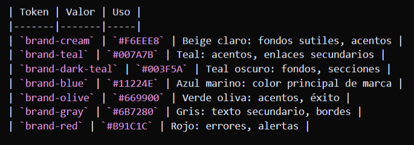

# Guía de Estilos Visuales — EMBARQUES

Documento de referencia para mantener un estándar visual coherente en todo el proyecto.

**Fuente de verdad en código:** `lib/brand.ts` — centraliza logo, fuente, colores, iconos, formas, layout y animaciones. Al crear nuevos elementos, importar desde `brand` y seguir esta guía.

---

## Principio de diseño

**Estilo cuadrado tipo Windows + animaciones tipo Mac**

- **Formas:** Bordes rectos o ligeramente redondeados (tipo Windows): ventanas cuadradas, bloques definidos, menos curvatura.
- **Animaciones:** Fluidas y suaves (tipo Mac): transiciones `ease-out`, `cubic-bezier`, micro-interacciones discretas, entradas/salidas elegantes.

En resumen: apariencia sobria y profesional, con feedback visual refinado en hover, focus y apertura/cierre de modales.

---

## Índice

1. [Colores](#colores)
2. [Tipografía](#tipografía)
3. [Espaciado](#espaciado)
4. [Bordes y radios](#bordes-y-radios)
5. [Sombras](#sombras)
6. [Componentes UI](#componentes-ui)
7. [Layout y estructura](#layout-y-estructura)
8. [Animaciones y transiciones](#animaciones-y-transiciones)
9. [Iconos](#iconos)
10. [Estados interactivos](#estados-interactivos)

---

## Colores

### Paleta principal

Fuente: `lib/brand.ts` — `colors` y `colorPalette`. VS Code muestra un cuadrito de color junto a cada hex si `editor.colorDecorators` está activo.

| Token | Muestra | Valor | Uso |
|-------|---------|-------|-----|
| `brand-cream` | <span style="display:inline-block;width:14px;height:14px;background:#F6EEE8;border:1px solid #ccc;vertical-align:middle;border-radius:2px;"></span> | `#F6EEE8` | Beige claro: fondos sutiles, acentos |
| `brand-teal` | <span style="display:inline-block;width:14px;height:14px;background:#007A7B;border:1px solid #555;vertical-align:middle;border-radius:2px;"></span> | `#007A7B` | Teal: acentos, enlaces secundarios |
| `brand-dark-teal` | <span style="display:inline-block;width:14px;height:14px;background:#003F5A;border:1px solid #333;vertical-align:middle;border-radius:2px;"></span> | `#003F5A` | Teal oscuro: fondos, secciones |
| `brand-blue` | <span style="display:inline-block;width:14px;height:14px;background:#11224E;border:1px solid #111;vertical-align:middle;border-radius:2px;"></span> | `#11224E` | Azul marino: color principal de marca |
| `brand-olive` | <span style="display:inline-block;width:14px;height:14px;background:#669900;border:1px solid #333;vertical-align:middle;border-radius:2px;"></span> | `#669900` | Verde oliva: acentos, éxito |
| `brand-gray` | <span style="display:inline-block;width:14px;height:14px;background:#6B7280;border:1px solid #333;vertical-align:middle;border-radius:2px;"></span> | `#6B7280` | Gris: texto secundario, bordes |
| `brand-red` | <span style="display:inline-block;width:14px;height:14px;background:#B91C1C;border:1px solid #333;vertical-align:middle;border-radius:2px;"></span> | `#B91C1C` | Rojo: errores, alertas |

### Escala neutra

| Token | Uso |
|-------|-----|
| `white` | Fondos de header, cards, modales |
| `neutral-100`, `neutral-200` | Fondos sutiles, bordes suaves, placeholders |
| `neutral-400`, `neutral-500` | Texto secundario, etiquetas pequeñas |
| `neutral-600` | NavBanner, Sidebar, barra de navegación |
| `neutral-800` | Texto oscuro en hover |

### Semánticos

| Token | Uso |
|-------|-----|
| `emerald-50` / `emerald-800` | Mensajes de éxito, confirmación |
| `red-50` / `red-600` / `red-700` | Errores, alertas, botón cerrar sesión |

### Opacidad

- `white/95` — Cards y modales sobre fondo oscuro
- `white/90`, `white/60` — Texto sobre fondo brand-blue
- `black/25` — Overlay de modales
- `black/5` — Bordes muy sutiles
- `neutral-200/80` — Fondos de hover suaves
- `brand-blue/30` — Anillo de focus

---

## Tipografía

### Fuente

- **Familia:** Open Sans (`font-sans` via `var(--font-open-sans)`)
- **Body:** `antialiased` en `<body>`

### Tamaños y pesos

| Contexto | Clases | Uso |
|----------|--------|-----|
| Título de sección | `text-xl font-semibold text-brand-blue tracking-tight` | Títulos de formularios, modales |
| Título de modal | `text-base font-medium text-brand-blue tracking-tight` | Encabezados de modales |
| Subtítulo | `text-sm text-neutral-500` | Descripción bajo el título |
| Etiquetas de formulario | `text-xs font-medium text-neutral-600 uppercase tracking-wider` | Labels de inputs |
| Cuerpo de card | `text-[15px]` o `text-sm` | Contenido principal |
| Labels pequeños | `text-[11px] font-medium text-neutral-500 uppercase tracking-wider` | Etiquetas en cards de perfil |
| Footer | `text-xs text-white/60` o `text-neutral-500` | Pie de página, texto auxiliar |
| Links en nav | `text-sm font-medium uppercase tracking-wide` | NavBanner |
| Links del sidebar | `text-base` | Sidebar |

---

## Espaciado

### Gaps entre elementos

| Valor | Uso |
|-------|-----|
| `gap-2` | Entre iconos y texto, ítems muy cercanos |
| `gap-3` | Entre logo y título en header |
| `gap-4` | Entre campos de formulario, bloques en modales |
| `gap-6` | Separación de secciones |
| `gap-8` | Navegación principal (NavBanner) |

### Padding

| Componente | Clases |
|------------|--------|
| Header | `px-4` |
| NavBanner | `px-4` |
| Sidebar | `pt-16 pb-3 px-2` |
| Cards / Modales | `p-6` |
| Inputs | `px-4 py-2.5` |
| Botones primarios | `py-3 px-4` |
| Botones secundarios | `px-4 py-2` o `py-2.5 px-4` |
| Bloques de info | `p-4` |
| Padding de página auth | `p-4` |

### Márgenes

| Contexto | Clases |
|----------|--------|
| Título → subtítulo | `mb-1` |
| Subtítulo → formulario | `mb-6` |
| Mensaje → siguiente elemento | `mb-4` |
| Formulario → enlace auxiliar | `mt-6` |
| Separador en modal | `mt-5 pt-4 border-t` |

---

## Bordes y radios

*Estilo cuadrado: priorizar `rounded` o `rounded-sm`; usar `rounded-lg` solo cuando aporte claridad (inputs, botones). Evitar radios muy grandes.*

| Radio | Clases | Uso |
|-------|--------|-----|
| Ninguno / sutil | `rounded` o `rounded-sm` | Bordes básicos, preferido para estilo Windows |
| Mediano | `rounded-lg` | Inputs, botones, cards cuando haga falta suavidad |
| Grande | `rounded-xl` | Bloques de info dentro de modales |
| Extra grande | `rounded-2xl` | Modales, cards principales (usar con moderación) |
| Circular | `rounded-full` | Iconos de usuario, botón cerrar modal |

### Bordes

| Uso | Clases |
|-----|--------|
| Input / Select | `border border-neutral-200` |
| Card sutil | `border border-black/5` |
| Separador | `border-t border-neutral-200` |
| Borde lateral sidebar | `border-l border-neutral-500` |
| Indicador activo | `border-b-2 border-white` |

---

## Sombras

| Token | Clases | Uso |
|-------|--------|-----|
| `shadow-md` | NavBanner |
| `shadow-lg` | Sidebar, botón colapsar |
| `shadow-mac-modal` | Modales, cards de auth (definido en `tailwind.config.ts`) |

---

## Componentes UI

### Inputs

```
w-full px-4 py-2.5 rounded-lg border border-neutral-200 bg-white
text-brand-blue placeholder:text-neutral-400
focus:outline-none focus:ring-2 focus:ring-brand-blue/30 focus:border-brand-blue
transition-colors disabled:opacity-60 disabled:cursor-not-allowed
```

### Botón primario

```
py-3 px-4 rounded-lg bg-brand-blue text-white font-medium
hover:bg-brand-blue/90
focus:outline-none focus:ring-2 focus:ring-brand-blue/50 focus:ring-offset-2
transition-colors disabled:opacity-60 disabled:cursor-not-allowed
```

### Botón secundario (link / acción suave)

```
px-4 py-2 rounded-lg text-sm font-medium text-brand-blue
hover:bg-neutral-200/80
transition-colors focus:outline-none focus:ring-2 focus:ring-brand-blue/30
```

### Botón destructivo (cerrar sesión)

```
py-2.5 px-4 rounded-lg text-sm font-medium text-red-600
hover:bg-red-50 focus:outline-none focus:ring-2 focus:ring-red-200
transition-colors
```

### Card / Modal

```
bg-white/95 backdrop-blur-xl rounded-2xl shadow-mac-modal
p-6 border border-black/5
```

### Bloque de información (perfil, datos)

```
rounded-xl bg-neutral-100/80 p-4
```

### Mensaje de éxito

```
p-3 rounded-lg bg-emerald-50 text-emerald-800 text-sm
```

### Mensaje de error / alerta

```
p-3 rounded-lg bg-red-50 text-red-700 text-sm
```

### Link en texto

```
text-brand-blue font-medium hover:underline focus:outline-none focus:underline
```

---

## Layout y estructura

### Header

- Altura fija: `h-[50px] min-h-[50px]`
- Fondo: `bg-white`
- Posición: `sticky top-0 z-50`
- Flex: `flex items-center justify-between px-4`

### NavBanner

- Altura: `h-[30px] min-h-[30px]`
- Fondo: `bg-neutral-600`
- Sombra: `shadow-md`

### Sidebar

- Ancho: `w-40`
- Fondo: `bg-neutral-600`
- Padding: `pt-16 pb-3 px-2`
- Sombra: `shadow-lg`

### Main (contenido)

```
flex-1 bg-brand-blue min-h-0 overflow-auto
```

### Layout auth (login / registro)

- Fondo: `min-h-screen bg-brand-blue p-4`
- Contenedor: `max-w-md` centrado
- Logo: `absolute top-6 left-1/2 -translate-x-1/2`
- Footer: `text-xs text-white/60 text-center`

---

## Animaciones y transiciones

*Estilo Mac: animaciones fluidas y suaves, sin exceso.*

### Transiciones estándar

- `transition-colors` — Cambios de color en hover/focus (suave, ~200ms implícito)
- `transition-all duration-200` — Botones, iconos
- `transition-all duration-300 ease-in-out` — Sidebar colapsar, elementos que se desplazan

### Animaciones custom (`tailwind.config.ts`)

| Nombre | Uso |
|--------|-----|
| `animate-modal-in` | Entrada del contenido del modal (`cubic-bezier(0.32, 0.72, 0, 1)`) |
| `animate-backdrop-in` | Entrada del overlay del modal |

Mantener curvas tipo Mac: `ease-out` o `cubic-bezier` para sensación premium.

### Loading

- `animate-pulse` — Placeholders y estados de carga

---

## Iconos

- **Set:** Typicons (`typcn:`, ej. `typcn:key-outline`, `typcn:arrow-left-outline`)
- **Color principal:** `text-brand-blue` o `text-white` según contexto
- **Tamaño estándar:** `width={12} height={12}` para pequeños, `18` para botones
- **Hover:** heredan color del contenedor o `text-neutral-300 hover:text-white`

---

## Estados interactivos

### Hover

| Elemento | Efecto |
|----------|--------|
| Links nav | `text-neutral-300 hover:text-white` o `border-b-2` si activo |
| Links sidebar | `text-neutral-200 hover:text-white hover:bg-neutral-500` |
| Botones | `hover:bg-{color}/90` o `hover:bg-neutral-200/80` |
| Inputs | focus ring (no hover) |
| Iconos | `hover:bg-neutral-200/80` |

### Focus

- Siempre incluir `focus:outline-none` y un `focus:ring-2` o `focus:underline` visible.
- Inputs: `focus:ring-brand-blue/30 focus:border-brand-blue`
- Botones primarios: `focus:ring-brand-blue/50 focus:ring-offset-2`
- Links: `focus:underline`

### Disabled

- `disabled:opacity-60 disabled:cursor-not-allowed`

---

## Checklist para nuevos componentes

Al crear o modificar componentes, revisar:

1. **Colores:** Usar `brand-blue` para primarios y `neutral-*` para secundarios.
2. **Tipografía:** Títulos `text-brand-blue`, secundarios `text-neutral-500`.
3. **Espaciado:** `gap-4` entre campos, `p-6` en cards.
4. **Radios:** `rounded-lg` inputs/botones, `rounded-2xl` modales.
5. **Sombras:** `shadow-mac-modal` para modales y cards destacadas.
6. **Focus:** Siempre anillo de focus visible.
7. **Transiciones:** `transition-colors` en elementos interactivos.
